# SITEMAP CÂY MÀN HÌNH VÀ SCREEN FLOW TOÀN HỆ THỐNG – GIA SƯ AI

**Phiên bản:** V3 – Sitemap cây màn hình, hành động điều hướng và dữ liệu liên vai trò  
**Ngày:** 30/07/2026  
**Nguồn nghiệp vụ chính:** `describe_feature_gia_su_ai(3).csv`  
**Nguồn đối chiếu:** FE/BE hiện tại và tài liệu `Phan_tich_man_hinh_va_Screen_Flow_Gia_Su_AI.md`

## 1. Mục tiêu tài liệu

Tài liệu xác định toàn bộ màn hình cần có để triển khai các chức năng của Gia Sư AI trong phiên bản hiện tại. Mỗi màn hình được mô tả theo chuỗi:

`Màn hình nguồn → Màn hình hiện tại → thao tác/điều kiện → Màn hình đích`

Tài liệu dùng cho Product Designer, UX/UI Designer, BA, SA, Frontend, Backend và QA để:

- Hiểu cấu trúc thông tin theo vai trò.
- Biết màn hình được truy cập từ đâu.
- Biết chức năng và hành động được thực hiện tại màn hình.
- Biết kết quả của từng hành động dẫn đến màn hình hoặc trạng thái nào.
- Phân biệt màn hình có route độc lập với modal, drawer, tab và trạng thái xử lý.

## 2. Phạm vi và nguyên tắc

### 2.1. Phạm vi thực hiện

Bao gồm:

- Xác thực, tài khoản và phân quyền.
- Nội dung học tập, khóa học, Lesson và Microlearning.
- Học sinh học bài và dùng AI trong Microlearning.
- Bài tập, kiểm tra, lịch sử attempt, kiến thức yếu và Retake.
- Lớp học và buổi học.
- AI Service, AI chấm tự luận và AI sinh câu hỏi.
- Ngân hàng câu hỏi và ma trận đề.
- Kho học liệu dành cho Giáo viên.
- Tìm kiếm, báo lỗi/khiếu nại, audit và cấu hình hệ thống.

Không bao gồm:

- Nhận, xem, tải, thống kê chứng nhận.
- Quản lý mẫu hoặc lịch sử cấp chứng nhận.

Các chức năng `3.4`, `3.5`, `3.6` liên quan đến chứng nhận không được đưa vào sitemap phiên bản này.

### 2.2. Nguyên tắc đếm màn hình

- Một màn hình được tính khi có mục đích nghiệp vụ riêng và cần route hoặc trạng thái điều hướng độc lập.
- Tab trong cùng một workspace không được tính là màn hình nếu không làm thay đổi ngữ cảnh nghiệp vụ.
- Modal/drawer không tính vào tổng màn hình, nhưng được ghi rõ là trạng thái bắt buộc nếu chứa bước xác nhận, nhập lý do hoặc thông tin quyết định.
- Màn hình lỗi, loading, empty, forbidden không tính riêng; mọi màn hình dữ liệu phải thiết kế các trạng thái này.
- Tài liệu mô tả kiến trúc màn hình mục tiêu, không chỉ phản ánh các route FE đang có.

### 2.3. Tổng số màn hình mục tiêu

| Phân hệ | Số màn hình |
|---|---:|
| Công khai và xác thực (`PUB`, `AUTH`) | 8 |
| Dùng chung theo tài khoản (`COM`) | 4 |
| Học sinh (`STU`) | 27 |
| Giáo viên (`TEA`) | 23 |
| Quản trị viên (`ADM`) | 25 |
| **Tổng cộng** | **87** |

> Con số 87 không bao gồm modal/drawer bắt buộc và không bao gồm bất kỳ màn hình quản lý chứng nhận nào.

## 3. Quy ước mã màn hình

| Tiền tố | Phạm vi |
|---|---|
| `PUB` | Màn hình công khai |
| `AUTH` | Xác thực và khôi phục tài khoản |
| `COM` | Màn hình dùng chung sau đăng nhập |
| `STU` | Học sinh/Học viên |
| `TEA` | Giáo viên |
| `ADM` | Quản trị viên |

## 4. Sitemap tổng thể theo vai trò

```mermaid
flowchart TD
    ROOT["Gia Sư AI"]
    PUBLIC["Công khai và xác thực"]
    STUDENT["Không gian Học sinh"]
    TEACHER["Không gian Giáo viên"]
    ADMIN["Không gian Quản trị"]

    ROOT --> PUBLIC
    ROOT --> STUDENT
    ROOT --> TEACHER
    ROOT --> ADMIN

    PUBLIC --> P1["Trang chủ và tư vấn AI"]
    PUBLIC --> P2["Đăng ký, OTP, đăng nhập"]
    PUBLIC --> P3["Khôi phục mật khẩu"]

    STUDENT --> S1["Khám phá và đăng ký học"]
    STUDENT --> S2["Lớp học và buổi học"]
    STUDENT --> S3["Microlearning và AI"]
    STUDENT --> S4["Bài tập, điểm yếu, Retake"]

    TEACHER --> T1["Lớp và tiến độ học sinh"]
    TEACHER --> T2["Giao bài và tự luận"]
    TEACHER --> T3["Câu hỏi và ma trận đề"]
    TEACHER --> T4["Kho học liệu và gói Pro"]

    ADMIN --> A1["Tài khoản, quyền và audit"]
    ADMIN --> A2["Nội dung và học liệu"]
    ADMIN --> A3["Câu hỏi, AI và Assessment"]
    ADMIN --> A4["Lớp, báo cáo và hệ thống"]
```

## 5. Các flow chính toàn hệ thống

### 5.1. Flow chính Học sinh – khám phá và bắt đầu học

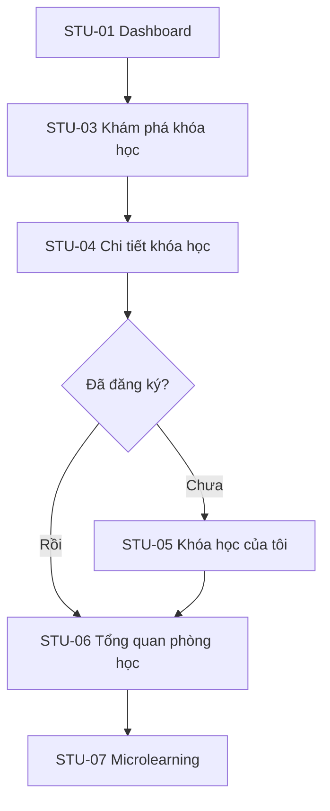
```mermaid
flowchart TD
    D["STU-01 Dashboard"]
    C["STU-03 Khám phá khóa học"]
    CD["STU-04 Chi tiết khóa học"]
    EN{"Đã đăng ký?"}
    MY["STU-05 Khóa học của tôi"]
    OV["STU-06 Tổng quan phòng học"]
    ML["STU-07 Microlearning"]

    D --> C
    C --> CD
    CD --> EN
    EN -->|Chưa| MY
    EN -->|Rồi| OV
    MY --> OV
    OV --> ML
```

### 5.2. Flow chính Học sinh – học bài và sử dụng AI trong Microlearning

Đây là flow chính độc lập của Học sinh, không được xem AI chỉ là tiện ích phụ.

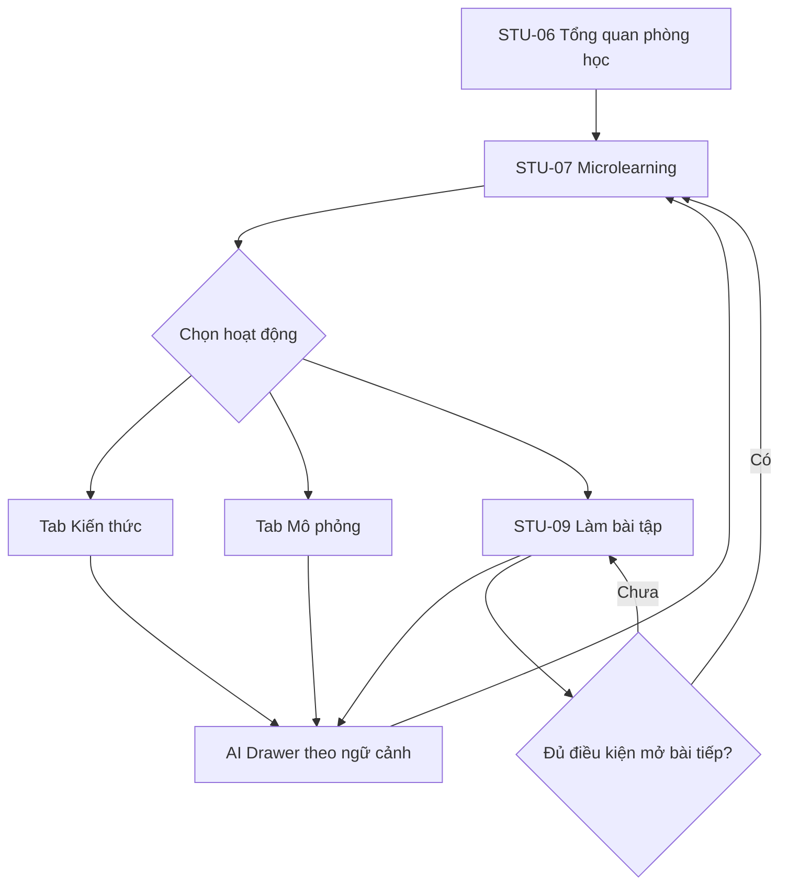
```mermaid
flowchart TD
    OV["STU-06 Tổng quan phòng học"]
    ML["STU-07 Microlearning"]
    TAB{"Chọn hoạt động"}
    KNOW["Tab Kiến thức"]
    SIM["Tab Mô phỏng"]
    EX["STU-09 Làm bài tập"]
    AI["AI Drawer theo ngữ cảnh"]
    NEXT{"Đủ điều kiện mở bài tiếp?"}

    OV --> ML
    ML --> TAB
    TAB --> KNOW
    TAB --> SIM
    TAB --> EX
    KNOW --> AI
    SIM --> AI
    EX --> AI
    AI --> ML
    EX --> NEXT
    NEXT -->|Có| ML
    NEXT -->|Chưa| EX
```

Quy tắc flow:

1. Học sinh vào đúng `Course → Module → Lesson → Microlearning`.
2. Màn Microlearning luôn thể hiện ba khu vực: Kiến thức, Mô phỏng, Bài tập.
3. AI nhận ngữ cảnh gồm khóa học, module, lesson, microlearning, tab và câu hỏi hiện tại.
4. AI không cung cấp đáp án trực tiếp khi học sinh đang làm bài tính điểm.
5. Nếu trả lời sai, học sinh xem giải thích và có thể làm câu tương tự không tính điểm.
6. Chỉ khi đạt điều kiện hoàn thành hoặc được Giáo viên mở khóa, học sinh mới đi tiếp.

### 5.3. Flow chính Học sinh – điểm yếu và Retake

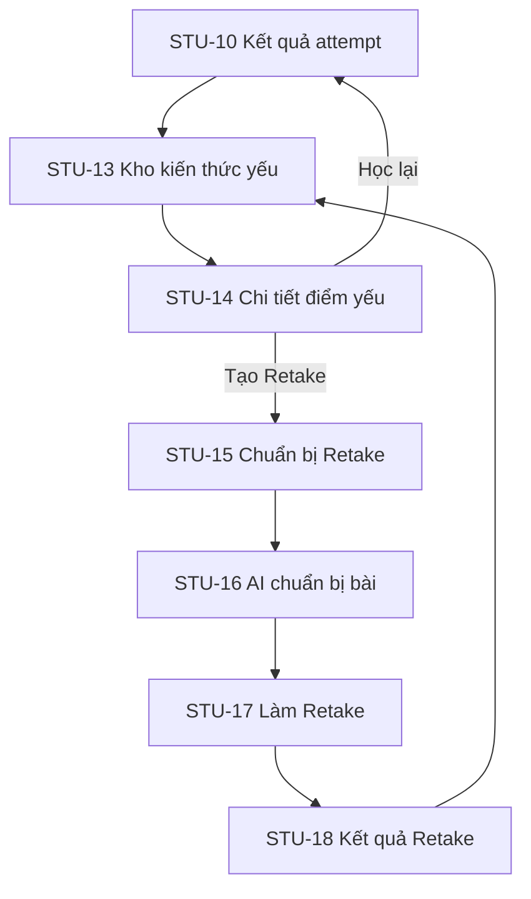
```mermaid
flowchart TD
    RESULT["STU-10 Kết quả attempt"]
    WEAK["STU-13 Kho kiến thức yếu"]
    DETAIL["STU-14 Chi tiết điểm yếu"]
    RETAKE["STU-15 Chuẩn bị Retake"]
    WAIT["STU-16 AI chuẩn bị bài"]
    TAKE["STU-17 Làm Retake"]
    RRESULT["STU-18 Kết quả Retake"]

    RESULT --> WEAK
    WEAK --> DETAIL
    DETAIL -->|Học lại| RESULT
    DETAIL -->|Tạo Retake| RETAKE
    RETAKE --> WAIT
    WAIT --> TAKE
    TAKE --> RRESULT
    RRESULT --> WEAK
```

### 5.4. Flow chính Giáo viên – giao bài

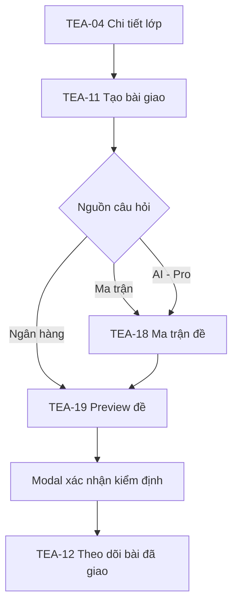
```mermaid
flowchart TD
    CLASS["TEA-04 Chi tiết lớp"]
    CREATE["TEA-11 Tạo bài giao"]
    SOURCE{"Nguồn câu hỏi"}
    MATRIX["TEA-18 Ma trận đề"]
    PREVIEW["TEA-19 Preview đề"]
    CONFIRM["Modal xác nhận kiểm định"]
    TRACK["TEA-12 Theo dõi bài đã giao"]

    CLASS --> CREATE
    CREATE --> SOURCE
    SOURCE -->|Ngân hàng| PREVIEW
    SOURCE -->|Ma trận| MATRIX
    SOURCE -->|AI - Pro| MATRIX
    MATRIX --> PREVIEW
    PREVIEW --> CONFIRM
    CONFIRM --> TRACK
```

### 5.5. Flow chính Admin – AI sinh câu hỏi và phê duyệt

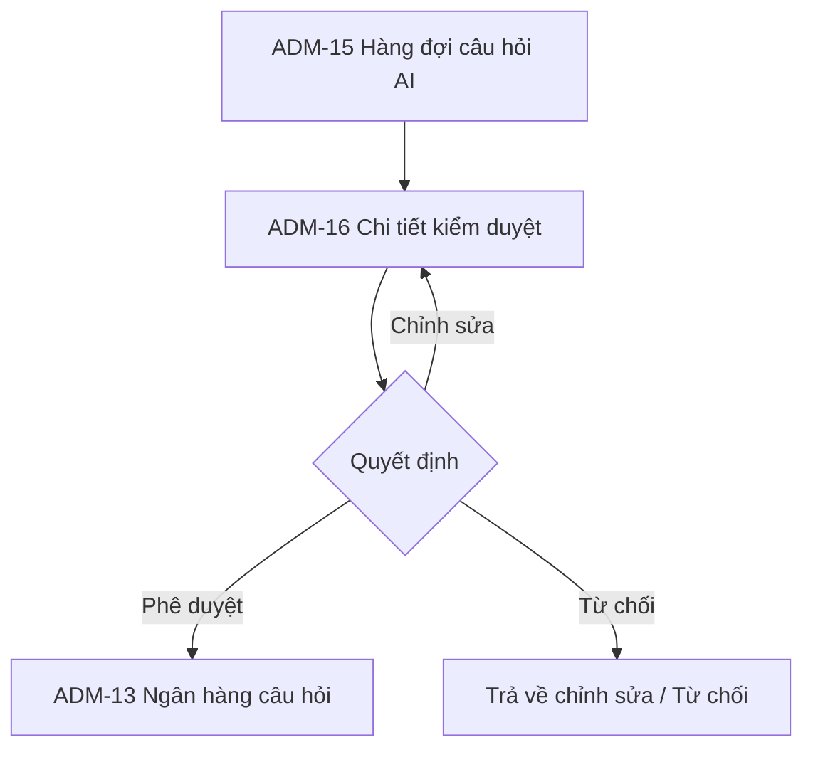
```mermaid
flowchart TD
    PENDING["ADM-15 Hàng đợi câu hỏi AI"]
    REVIEW["ADM-16 Chi tiết kiểm duyệt"]
    DECISION{"Quyết định"}
    BANK["ADM-13 Ngân hàng câu hỏi"]
    RETURN["Trả về chỉnh sửa / Từ chối"]

    PENDING --> REVIEW
    REVIEW --> DECISION
    DECISION -->|Phê duyệt| BANK
    DECISION -->|Chỉnh sửa| REVIEW
    DECISION -->|Từ chối| RETURN
```

## 6. Sitemap và đặc tả màn hình công khai, xác thực

| Mã | Màn hình | Mục đích và chức năng chính | Màn hình nguồn | Thao tác → màn hình đích |
|---|---|---|---|---|
| PUB-01 | Trang chủ | Giới thiệu hệ thống, khóa học nổi bật, ngành học, CTA đăng ký/đăng nhập, mở chatbot tư vấn. | Truy cập trực tiếp, logout | Chọn khóa → PUB-02; hỏi AI → PUB-03; đăng nhập → AUTH-04; đăng ký → AUTH-01 |
| PUB-02 | Chi tiết khóa học công khai | Xem mô tả, ngành, level, cấu trúc tổng quan và điều kiện học; không lộ nội dung bị khóa. | PUB-01, kết quả tìm kiếm công khai | Đăng ký học → AUTH-01 hoặc STU-04; quay lại → PUB-01 |
| PUB-03 | Chatbot tư vấn trang chủ | Tư vấn lộ trình, môn và khóa học; không giới hạn quota; hiển thị khóa được đề xuất. | PUB-01 | Chọn khóa đề xuất → PUB-02; đăng ký → AUTH-01; đóng chat → PUB-01 |
| AUTH-01 | Đăng ký tài khoản | Nhập thông tin, chọn Student/Teacher; Teacher chọn khối giảng dạy; chấp nhận điều khoản. | PUB-01, AUTH-04 | Gửi đăng ký → AUTH-02; đã có tài khoản → AUTH-04 |
| AUTH-02 | Xác thực OTP | Nhập OTP 6 số, đếm hiệu lực 5 phút, resend có giới hạn, hiển thị trạng thái khóa 15 phút. | AUTH-01, AUTH-05 | Đúng OTP → AUTH-03 hoặc AUTH-04; resend → ở lại; quá giới hạn → trạng thái khóa |
| AUTH-03 | Đăng ký thành công | Xác nhận tài khoản đã kích hoạt và hướng dẫn đăng nhập. | AUTH-02 | Đăng nhập → AUTH-04 |
| AUTH-04 | Đăng nhập | Xác thực tài khoản, xử lý session một thiết bị và thông báo kick-out phiên cũ theo cấu hình. | PUB-01, AUTH-03, COM-04, session hết hạn | Student → STU-01; Teacher → TEA-01; Admin → ADM-01; quên mật khẩu → AUTH-05 |
| AUTH-05 | Khôi phục mật khẩu | Flow ba bước: nhập email → AUTH-02 OTP → đặt mật khẩu mới; áp dụng resend và chống brute-force. | AUTH-04 | Gửi OTP → AUTH-02; đặt thành công → AUTH-04 |

### Trạng thái bắt buộc

- Email đã tồn tại/không tồn tại.
- OTP sai, hết hạn, đạt giới hạn resend hoặc bị khóa tạm thời.
- Tài khoản bị khóa/xóa.
- Phiên hiện tại bị đăng xuất do đăng nhập từ thiết bị khác.
- Sai vai trò hoặc route không có quyền truy cập.

## 7. Màn hình dùng chung sau đăng nhập

| Mã | Màn hình | Mục đích và chức năng chính | Màn hình nguồn | Thao tác → màn hình đích |
|---|---|---|---|---|
| COM-01 | Hồ sơ cá nhân | Xem/sửa họ tên, avatar và thông tin theo vai trò; Teacher xem khối/môn được cấp. | Header/menu tài khoản | Lưu → quay lại màn nguồn; bảo mật → COM-02; xóa tài khoản → modal xác nhận |
| COM-02 | Bảo mật và phiên đăng nhập | Xem lịch sử đăng nhập/đăng xuất, thời gian truy cập, đổi mật khẩu và phiên đang hoạt động. | COM-01 | Đổi mật khẩu → xác nhận tại chỗ; đăng xuất phiên → AUTH-04 |
| COM-03 | Kết quả tìm kiếm toàn văn | Hiển thị kết quả phân trang, sắp xếp tương đồng và bộ lọc đúng quyền từng vai trò. | Thanh tìm kiếm global | Student → STU-04/STU-07; Teacher → TEA-03/TEA-20; Admin → entity quản trị tương ứng |
| COM-04 | Report/Báo lỗi/Khiếu nại | Form chọn Lỗi hệ thống, AI ảo giác hoặc Khiếu nại điểm; nhập mô tả, đính kèm ngữ cảnh màn hiện tại. | Nút Report toàn cục | Gửi thành công → quay lại màn nguồn; chưa đăng nhập → AUTH-04 |

## 8. Sitemap Học sinh

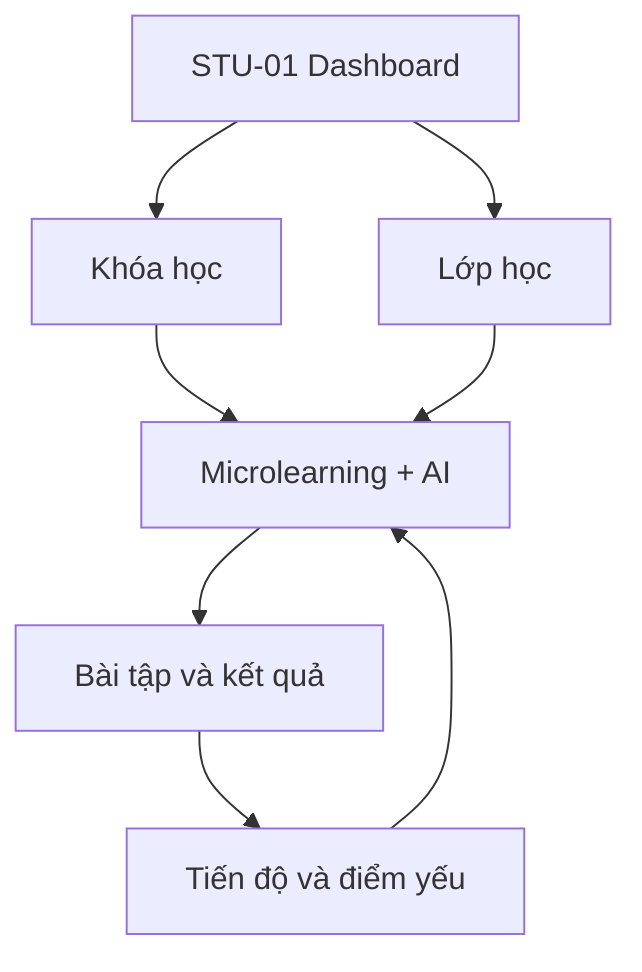
```mermaid
flowchart TD
    DASH["STU-01 Dashboard"]
    COURSE["Khóa học"]
    CLASS["Lớp học"]
    LEARN["Microlearning + AI"]
    PRACTICE["Bài tập và kết quả"]
    PERSONAL["Tiến độ và điểm yếu"]

    DASH --> COURSE
    DASH --> CLASS
    COURSE --> LEARN
    CLASS --> LEARN
    LEARN --> PRACTICE
    PRACTICE --> PERSONAL
    PERSONAL --> LEARN
```

### 8.1. Dashboard, ngành và khóa học

| Mã | Màn hình | Mục đích và chức năng chính | Màn hình nguồn | Thao tác → màn hình đích |
|---|---|---|---|---|
| STU-01 | Dashboard Học sinh | Tổng quan khóa đang học, lớp, tiến độ, retake còn lại, điểm cao nhất, lịch học gần nhất và gợi ý tiếp tục. | AUTH-04, logo/sidebar | Tiếp tục học → STU-06/07; tìm khóa → STU-03; vào lớp → STU-20; tiến độ → STU-12 |
| STU-02 | Danh sách ngành học | Tìm kiếm và xem các ngành; làm điểm vào để lọc khóa học. | STU-01, COM-03 | Chọn ngành → STU-03 với bộ lọc; tìm kiếm → kết quả tại chỗ |
| STU-03 | Khám phá khóa học | Tìm kiếm/lọc theo ngành, giáo viên và trạng thái Active; phân trang danh sách khóa công khai. | STU-01, STU-02, COM-03 | Chọn khóa → STU-04 |
| STU-04 | Chi tiết và đăng ký khóa học | Xem mô tả, cấu trúc Module/Lesson/Microlearning và điều kiện; đăng ký nhưng không tự hủy sau đăng ký. | STU-03, PUB-02, STU-23 | Đăng ký → STU-05 hoặc STU-06; đã sở hữu → STU-06; Assessment đầu vào → STU-22 |
| STU-05 | Khóa học của tôi | Danh sách đang học/đã hoàn thành, phần trăm tiến độ và hành động tiếp tục học. | STU-01, STU-04, sidebar | Chọn khóa → STU-06; tìm khóa mới → STU-03 |
| STU-06 | Tổng quan phòng học | Cấu trúc Course → Module → Lesson → Microlearning; thể hiện bài đã xong, hiện tại, bị khóa và lý do khóa. | STU-04, STU-05, STU-20 | Chọn Microlearning mở → STU-07; bài tập tổng hợp → STU-09; thông tin lớp → STU-21 |

### 8.2. Flow học bài và AI trong Microlearning

| Mã | Màn hình | Mục đích và chức năng chính | Màn hình nguồn | Thao tác → màn hình đích |
|---|---|---|---|---|
| STU-07 | Không gian Microlearning | Workspace học gồm ba tab bắt buộc: Kiến thức, Mô phỏng, Bài tập; breadcrumb đủ Course/Module/Lesson/Microlearning; lưu tiến độ. | STU-06, STU-14, STU-18 | Kiến thức/Mô phỏng → ở lại theo tab; bài tập → STU-09; lịch sử AI → STU-08; hoàn thành → Microlearning tiếp theo hoặc STU-06 |
| STU-08 | Lịch sử hội thoại AI | Danh sách và tìm lại cuộc trò chuyện theo khóa/bài; mở tiếp hội thoại có ngữ cảnh. | AI drawer tại STU-07/STU-09 | Chọn hội thoại → mở AI drawer tại đúng STU-07/STU-09; tạo hội thoại mới → quay lại màn gọi |
| STU-09 | Làm bài tập Microlearning | Nhiều loại câu hỏi, tự do điều hướng, lưu đáp án; AI hỗ trợ không đưa đáp án; hiển thị quota/cooldown. | STU-07, STU-10, STU-11 | Nộp bài → STU-10; hỏi AI → drawer tại chỗ; thoát có lưu nháp → STU-07 |
| STU-10 | Kết quả attempt | Điểm lần này, điểm cao nhất, trạng thái Completed; lưu Completed nếu từng đạt ngưỡng; danh sách đúng/sai. | STU-09 | Xem attempt → STU-11; làm lại → STU-09; xem điểm yếu → STU-13; bài tiếp → STU-07 |
| STU-11 | Chi tiết câu sai và luyện tương tự | Hiện đáp án sau nộp, giải thích tĩnh/AI, media; sinh câu tương đương không tính điểm. | STU-10, STU-14 | Làm câu tương tự → ở lại; hỏi AI → drawer; học lại lý thuyết → STU-07; quay lại → STU-10 |
| STU-12 | Tiến độ học tập cá nhân | Thống kê Lesson/Microlearning hoàn thành, tiến độ khóa, điểm cao nhất, attempt và retake còn lại. | STU-01, sidebar | Chọn khóa → STU-06; lịch sử attempt → STU-19; điểm yếu → STU-13 |

#### AI Drawer bắt buộc tại STU-07, STU-09, STU-11

AI Drawer không phải route riêng nhưng phải có:

- Ngữ cảnh đang học và nút mở lại lịch sử.
- Nội dung trả lời có trích nguồn học liệu khi phù hợp.
- Quota còn lại và bộ đếm cooldown.
- Trạng thái đang sinh, lỗi, hết quota và thử lại.
- Cơ chế chặn đáp án trực tiếp trong bài tính điểm.
- Nút Report phản hồi “AI ảo giác”.

### 8.3. Kho kiến thức yếu và Retake

| Mã | Màn hình | Mục đích và chức năng chính | Màn hình nguồn | Thao tác → màn hình đích |
|---|---|---|---|---|
| STU-13 | Kho kiến thức yếu | Tổng hợp câu sai theo Course/Module/Lesson/Microlearning, mức độ và xu hướng; đề xuất học lại hoặc Retake. | STU-10, STU-12, sidebar | Chọn điểm yếu → STU-14; tạo Retake tổng hợp → STU-15 |
| STU-14 | Chi tiết mảng kiến thức yếu | Xem các lỗi liên quan, lần sai, giải thích và nội dung cần ôn. | STU-13 | Học lại → STU-07; xem câu sai → STU-11; Retake → STU-15 |
| STU-15 | Cấu hình và yêu cầu Retake AI | Chọn phạm vi điểm yếu được phép, hiển thị quota 3 lần/ngày và xác nhận tạo bộ 10 dạng câu hỏi. | STU-13, STU-14, STU-18 | Xác nhận → STU-16; hết quota → ở lại với thời điểm reset |
| STU-16 | AI đang chuẩn bị Retake | Theo dõi tác vụ bất đồng bộ, cho phép rời màn hình và nhận thông báo khi xong. | STU-15, thông báo hệ thống | Hoàn tất → STU-17; lỗi → thử lại STU-15; rời đi → STU-01 |
| STU-17 | Làm bài Retake | Làm bộ câu hỏi tập trung điểm yếu, tự do điều hướng và nộp bài. | STU-16, thông báo | Nộp → STU-18; thoát/lưu → STU-13 |
| STU-18 | Kết quả Retake | Xem điểm, lỗi còn lại, thay đổi Learning Profile và hành động tiếp theo. | STU-17 | Điểm yếu → STU-13/14; học lại → STU-07; Retake mới → STU-15 |
| STU-19 | Lịch sử attempt và bài đã làm | Danh sách attempt chính thức/Retake/tự luận, điểm và trạng thái duyệt. | STU-12, STU-10 | Attempt trắc nghiệm → STU-10; tự luận → STU-24 |

### 8.4. Lớp học, buổi học và Assessment

| Mã | Màn hình | Mục đích và chức năng chính | Màn hình nguồn | Thao tác → màn hình đích |
|---|---|---|---|---|
| STU-20 | Lớp học của tôi | Danh sách lớp, khóa liên kết, giáo viên, hình thức và trạng thái. | STU-01, STU-21, sidebar | Chọn lớp → STU-21; tham gia lớp → STU-22 |
| STU-21 | Chi tiết lớp và lịch học | Xem cấu hình Online/Offline/Hybrid, chính sách, lịch lặp, danh sách buổi và trạng thái tham gia. | STU-20, email mời | Học khóa → STU-06; chọn buổi → STU-23; rời về danh sách → STU-20 |
| STU-22 | Tham gia lớp | Nhập invite code hoặc xác nhận link mời; xử lý Mở/Duyệt/Mời và trạng thái chờ duyệt. | STU-01, STU-20, email mời | Thành công → STU-21; chờ duyệt → STU-20 với trạng thái; lỗi → ở lại |
| STU-23 | Chi tiết buổi học | Xem thời gian, phòng/link Online, giảng viên và nội dung liên quan. | STU-01, STU-21 | Đến giờ → mở link/phòng; học liệu liên quan → STU-07; quay lại → STU-21 |
| STU-24 | Bài tự luận và kết quả | Soạn/nộp bài tự luận; sau nộp xem AI chấm nháp ở trạng thái chờ, chỉ xem điểm chính thức sau Teacher duyệt. | STU-07, bài được giao | Nộp → trạng thái Chờ duyệt; đã duyệt → xem điểm/nhận xét; quay lại → STU-19 |
| STU-25 | Thiết lập Assessment đầu vào | Chọn ngành/môn và xem hướng dẫn, cấu trúc, thời lượng trước khi bắt đầu đánh giá năng lực. | STU-01, STU-04 | Bắt đầu → STU-26; hủy → màn nguồn |
| STU-26 | Làm Assessment đầu vào | Hiển thị câu hỏi, tiến độ, điều hướng, lưu đáp án và xác nhận nộp. | STU-25 | Nộp → STU-27; thoát có xác nhận → STU-25 |
| STU-27 | Kết quả và khóa học đề xuất | Hiển thị điểm, level đã mapping và danh sách khóa phù hợp theo cấu hình Admin. | STU-26 | Chọn khóa → STU-04; về Dashboard → STU-01; làm lại nếu được phép → STU-25 |

## 9. Sitemap Giáo viên

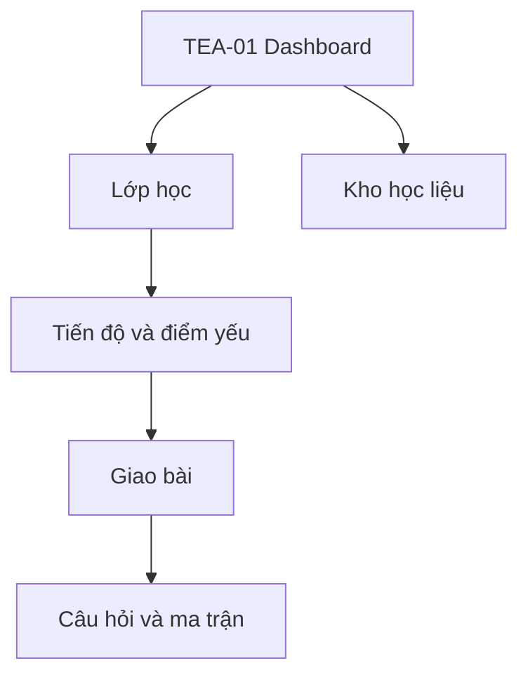
```mermaid
flowchart TD
    DASH["TEA-01 Dashboard"]
    CLASSES["Lớp học"]
    PROGRESS["Tiến độ và điểm yếu"]
    ASSIGN["Giao bài"]
    QUESTION["Câu hỏi và ma trận"]
    RESOURCE["Kho học liệu"]

    DASH --> CLASSES
    CLASSES --> PROGRESS
    PROGRESS --> ASSIGN
    ASSIGN --> QUESTION
    DASH --> RESOURCE
```

### 9.1. Dashboard, khóa và lớp học

| Mã | Màn hình | Mục đích và chức năng chính | Màn hình nguồn | Thao tác → màn hình đích |
|---|---|---|---|---|
| TEA-01 | Dashboard Giáo viên | Tổng quan lớp, học sinh, bài chờ xử lý, buổi sắp tới, lớp có nguy cơ và trạng thái gói. | AUTH-04, logo/sidebar | Lớp → TEA-03; bài chờ duyệt → TEA-14; nâng cấp → TEA-23 |
| TEA-02 | Khóa học được quyền dạy | Tìm kiếm khóa theo khối/môn được cấp; xem cấu trúc read-only; chọn khóa để mở lớp. | TEA-01, sidebar | Chọn khóa → STU-06 ở chế độ Teacher read-only; tạo lớp → TEA-05 |
| TEA-03 | Danh sách lớp | Tìm/lọc lớp tự tạo hoặc được Admin phân công; xem mã mời, trạng thái và sĩ số. | TEA-01, sidebar | Chọn lớp → TEA-04; tạo lớp → TEA-05 |
| TEA-04 | Chi tiết và vận hành lớp | Thông tin lớp, học sinh, mã mời, khóa/mở lớp, reset/vô hiệu mã; điều hướng các nghiệp vụ lớp. | TEA-03, TEA-05 | Cấu hình → TEA-06; học sinh → TEA-09; yêu cầu vào lớp → TEA-07; buổi học → TEA-08; giao bài → TEA-11 |
| TEA-05 | Tạo lớp | Chọn khóa được quyền dạy, tên lớp; sau tạo hệ thống sinh mã mời duy nhất. | TEA-02, TEA-03 | Tạo thành công → TEA-06 hoặc TEA-04; hủy → TEA-03 |
| TEA-06 | Cấu hình lớp | Chọn Online/Offline/Hybrid, Mở/Duyệt/Mời, lịch học lặp và chính sách mở/khóa bài. | TEA-04, TEA-05 | Lưu → TEA-04; cấu hình buổi → TEA-08 |
| TEA-07 | Mời và phê duyệt học sinh | Nhập email mời; xem hàng đợi, duyệt/từ chối và trạng thái gửi. | TEA-04 | Duyệt/từ chối → ở lại cập nhật; học sinh đã vào → TEA-09 |
| TEA-08 | Quản lý buổi học | Xem buổi tự sinh; tạo/sửa buổi thủ công, thời gian, phòng/link và giảng viên. | TEA-04, TEA-06 | Chọn buổi → form chi tiết tại chỗ; lưu → TEA-04/08 |

### 9.2. Tiến độ, giao bài và tự luận

| Mã | Màn hình | Mục đích và chức năng chính | Màn hình nguồn | Thao tác → màn hình đích |
|---|---|---|---|---|
| TEA-09 | Dashboard tiến độ lớp | Tổng quan hoàn thành, điểm, lỗi thường gặp, Bloom và học sinh cần chú ý; dữ liệu tổng hợp, không gọi AI. | TEA-04, TEA-01 | Chọn học sinh → TEA-10; bài đã giao → TEA-12 |
| TEA-10 | Chi tiết tiến độ học sinh | Theo Course/Module/Lesson/Microlearning: trạng thái, điểm, attempt, điểm yếu và bài tự luận. | TEA-09, danh sách học sinh TEA-04 | Override → modal bắt buộc lý do; giao bài → TEA-11; điểm yếu → chi tiết tại chỗ; tự luận → TEA-14 |
| TEA-11 | Tạo bài giao | Chọn lớp/học sinh, nguồn câu hỏi, phạm vi, deadline; dùng ngân hàng hoặc AI nếu Pro. | TEA-04, TEA-10, TEA-16, TEA-19 | Chọn câu → TEA-17; ma trận → TEA-18; preview → TEA-19 |
| TEA-12 | Danh sách bài đã giao | Xem bài, đối tượng, deadline, tỷ lệ làm và trạng thái; lọc theo lớp. | TEA-04, TEA-11, sidebar | Chọn bài → TEA-13 |
| TEA-13 | Kết quả bài đã giao | Theo dõi từng học sinh, điểm, attempt, hoàn thành/chưa hoàn thành và xuất dữ liệu được phép. | TEA-12 | Chọn học sinh → TEA-10; override → modal lý do; quay lại → TEA-12 |
| TEA-14 | Hàng đợi bài tự luận | Danh sách bài AI đã chấm nháp: Chờ duyệt/Đã duyệt; lọc theo lớp/bài. | TEA-01, TEA-04, TEA-10 | Chọn bài → TEA-15 |
| TEA-15 | Duyệt bài tự luận | Xem bài nộp, rubric, điểm/nhận xét AI; sửa và công bố kết quả chính thức. | TEA-14 | Duyệt/công bố → TEA-14; học sinh → TEA-10 |

#### Modal Override điểm bắt buộc

Tại TEA-10/13, Giáo viên phải:

1. Xem điểm/trạng thái cũ.
2. Nhập điểm/trạng thái mới.
3. Nhập lý do bắt buộc.
4. Xác nhận.
5. Hệ thống lưu người sửa, thời gian, giá trị cũ/mới và lý do.

### 9.3. Ngân hàng câu hỏi và ma trận đề

| Mã | Màn hình | Mục đích và chức năng chính | Màn hình nguồn | Thao tác → màn hình đích |
|---|---|---|---|---|
| TEA-16 | Kho câu hỏi của Giáo viên | Xem câu sở hữu/được cấp; lọc Bloom/chương; import/export đúng quyền; tách câu cá nhân và hệ thống. | TEA-01, sidebar, TEA-11 | Chọn câu → TEA-17; tạo mới → TEA-17; ma trận → TEA-18 |
| TEA-17 | Tạo/sửa/chi tiết câu hỏi | Soạn câu, tối đa 1 ảnh/audio, đáp án và giải thích; media chỉ chính thức khi lưu. | TEA-16, kết quả import | Lưu → TEA-16; gửi đóng góp → trạng thái Pending; hủy → TEA-16 |
| TEA-18 | Thiết lập ma trận đề | Chọn một/nhiều chương; nhập số câu theo bốn mức Bloom; kiểm tra tổng và nguồn sinh. | TEA-11, TEA-16 | Ngân hàng đủ → TEA-19; thiếu → TEA-17/điều chỉnh; dùng AI Pro → trạng thái Pending và TEA-19 khi đủ |
| TEA-19 | Preview và xác nhận giao đề | Xem đề đã bốc/sinh, thay câu, kiểm tra đáp án; trước giao hiển thị checkbox chịu trách nhiệm kiểm định. | TEA-11, TEA-18 | Xác nhận kiểm định + giao → TEA-12; sửa ma trận → TEA-18; sửa câu → TEA-17 |

### 9.4. Kho học liệu và gói Giáo viên

| Mã | Màn hình | Mục đích và chức năng chính | Màn hình nguồn | Thao tác → màn hình đích |
|---|---|---|---|---|
| TEA-20 | Kho học liệu Giáo viên | Cây học liệu read-only theo khối/môn được cấp; phân loại miễn phí/trả phí; tìm theo tiêu đề/mô tả. | TEA-01, sidebar, COM-03 | Chọn tài liệu → TEA-21; lọc → cập nhật tại chỗ |
| TEA-21 | Chi tiết/preview học liệu | Preview docs/pdf/ppt/video, metadata và quyền; ghi log khi xem; tải nếu được phép. | TEA-20 | Tải → modal/xác nhận và ở lại; quay lại → TEA-20 |
| TEA-22 | Lịch sử import/export câu hỏi | Theo dõi tác vụ nền, số dòng thành công/lỗi, tải file log hoặc file export bằng URL có hạn. | TEA-16 | Hoàn tất → TEA-16; tải log → ở lại |
| TEA-23 | Gói tài khoản và nâng cấp Pro | So sánh Free/Pro, quota AI; hiển thị QR SePay, đếm 5 phút và hướng dẫn liên hệ nếu chưa kích hoạt. | TEA-01, COM-01, tính năng AI bị giới hạn | Đã kích hoạt → TEA-01/TEA-16; hết thời gian → trạng thái hỗ trợ; hủy → màn nguồn |

## 10. Sitemap Quản trị viên

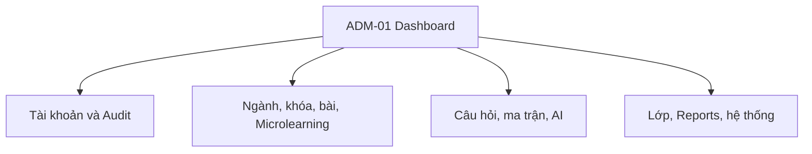
```mermaid
flowchart TD
    DASH["ADM-01 Dashboard"]
    USERS["Tài khoản và Audit"]
    CONTENT["Ngành, khóa, bài, Microlearning"]
    QUESTIONS["Câu hỏi, ma trận, AI"]
    OPERATIONS["Lớp, Reports, hệ thống"]

    DASH --> USERS
    DASH --> CONTENT
    DASH --> QUESTIONS
    DASH --> OPERATIONS
```

### 10.1. Dashboard, tài khoản và audit

| Mã | Màn hình | Mục đích và chức năng chính | Màn hình nguồn | Thao tác → màn hình đích |
|---|---|---|---|---|
| ADM-01 | Dashboard Admin | KPI học sinh/giáo viên/khóa/pass; hoạt động, AI/API, report mới và shortcut quản trị. | AUTH-04, logo/sidebar | Người dùng → ADM-02; report → ADM-21; audit → ADM-04; AI → ADM-18 |
| ADM-02 | Quản lý người dùng | Tìm/lọc, xem, sửa, role, trạng thái và tổ chức; khóa/mở tài khoản. | ADM-01, sidebar, COM-03 | Chọn user → ADM-03; tạo/sửa → ADM-03 |
| ADM-03 | Chi tiết và phân quyền người dùng | Hồ sơ, role, khối/môn Teacher, tổ chức, trạng thái Pro; chỉnh sửa và khóa. | ADM-02, ADM-23 | Lưu → ADM-02; audit liên quan → ADM-04; gói → ADM-23 |
| ADM-04 | Audit Log toàn hệ thống | Tra cứu hành động nhạy cảm: user, admin, điểm override, kiểm định đề, học liệu, đăng nhập. | ADM-01, ADM-03, ADM-14, ADM-21 | Chọn log → ADM-05 |
| ADM-05 | Chi tiết Audit Log | Xem actor, đối tượng, thời gian, dữ liệu cũ/mới, lý do và context; read-only. | ADM-04 | Quay lại → ADM-04; đối tượng liên quan → màn quản trị tương ứng |

### 10.2. Nội dung học tập và kho học liệu

| Mã | Màn hình | Mục đích và chức năng chính | Màn hình nguồn | Thao tác → màn hình đích |
|---|---|---|---|---|
| ADM-06 | Quản lý ngành học | Thêm/sửa/khóa, tìm kiếm và xem khóa thuộc ngành. | ADM-01, sidebar | Chọn ngành → form tại chỗ; xem khóa → ADM-07 |
| ADM-07 | Quản lý khóa học | Tìm/lọc, tạo/sửa/khóa; xem cấu trúc và import nội dung. | ADM-01, ADM-06, sidebar | Tạo/sửa → ADM-08; cấu trúc → ADM-09 |
| ADM-08 | Form khóa học | Nhập ngành, level, mô tả, ảnh, trạng thái và thông tin hiển thị. | ADM-07 | Lưu → ADM-07/09; hủy → ADM-07 |
| ADM-09 | Cấu trúc Module/Lesson/Microlearning | Cây nội dung; thêm/sửa/xóa/sắp xếp và kiểm định đúng cấp. | ADM-07, ADM-08 | Chọn Microlearning → ADM-10; chỉnh node → form tại chỗ; quay lại → ADM-07 |
| ADM-10 | Biên tập Microlearning | Quản lý ba nhóm nội dung bắt buộc: Kiến thức, Mô phỏng, Bài tập; preview như Học sinh. | ADM-09 | Tài nguyên → ADM-11; câu hỏi → ADM-13; preview → STU-07 chế độ preview; lưu → ADM-09 |
| ADM-11 | Kho tài nguyên học tập | Quản lý lý thuyết, video, slide, mô phỏng HTML; kiểm tra định dạng/dung lượng dưới 16MB. | ADM-10, sidebar | Upload/sửa → ADM-12; gắn vào Microlearning → ADM-10 |
| ADM-12 | Chi tiết và kiểm định tài nguyên | Preview, metadata, quyền, mã hóa/bảo vệ mô phỏng HTML; duyệt hoặc từ chối. | ADM-11, ADM-20 | Duyệt → ADM-11/20; sửa → ở lại; xóa → ADM-11 |

### 10.3. Câu hỏi, Assessment và AI

| Mã | Màn hình | Mục đích và chức năng chính | Màn hình nguồn | Thao tác → màn hình đích |
|---|---|---|---|---|
| ADM-13 | Ngân hàng câu hỏi hệ thống | CRUD, tìm/lọc theo Bloom/chương, media, import/export và câu AI đã duyệt. | ADM-01, ADM-10, ADM-16 | Tạo/sửa → ADM-14; Pending AI → ADM-15 |
| ADM-14 | Tạo/sửa/chi tiết câu hỏi | Nội dung, loại câu, đáp án, giải thích, Bloom, liên kết kiến thức và media; quản lý vùng tạm. | ADM-13, ADM-16 | Lưu → ADM-13; audit → ADM-04; hủy → ADM-13 |
| ADM-15 | Hàng đợi câu hỏi AI | Danh sách Pending từ Teacher/ma trận/AI; lọc nguồn, người tạo, chương và tuổi tác hàng đợi. | ADM-01, ADM-13, sidebar | Chọn câu/bộ câu → ADM-16 |
| ADM-16 | Kiểm duyệt câu hỏi AI | Xem nguồn/prompt/ngữ cảnh, sửa nội dung; duyệt/từ chối và ghi lý do. | ADM-15 | Duyệt → ADM-13; từ chối → ADM-15; lưu sửa → ở lại |
| ADM-17 | Cấu hình Assessment và chuẩn điểm | Mapping điểm → level → khóa đề xuất; cấu hình ngưỡng pass mặc định hoặc theo môn. | ADM-01, sidebar | Lưu → ADM-01; preview mapping → tại chỗ |
| ADM-18 | Quản trị AI, RAG và Prompt | Nạp/quét tài liệu, nguồn RAG, prompt chatbot, quota/cooldown, cache giải thích và token Pro. | ADM-01, sidebar | Nguồn học liệu → ADM-20; log tiêu thụ → ADM-19; lưu → ADM-01 |
| ADM-19 | Giám sát AI và API | Lượt chat, token, chi phí, Retake async, lỗi, cache hit và báo cáo AI chấm tự luận. | ADM-01, ADM-18 | Chọn log → chi tiết tại chỗ; cấu hình → ADM-18 |
| ADM-20 | Quản trị kho học liệu Giáo viên | Cấu trúc cây, miễn phí/trả phí, tìm/lọc; upload/quản lý/kiểm định file; xem audit xem/tải. | ADM-01, ADM-11, sidebar | Tài liệu → ADM-12; audit → ADM-04; chỉnh cây → tại chỗ |

### 10.4. Lớp, reports, gói và hệ thống

| Mã | Màn hình | Mục đích và chức năng chính | Màn hình nguồn | Thao tác → màn hình đích |
|---|---|---|---|---|
| ADM-21 | Hộp thư Report/Khiếu nại | Nhận report đã định tuyến; lọc loại, tổ chức, trạng thái, mức ưu tiên. | ADM-01, sidebar | Chọn report → ADM-22 |
| ADM-22 | Chi tiết và xử lý Report | Xem người gửi, màn nguồn, nội dung, bằng chứng và lịch sử; phân công, phản hồi, đóng/mở lại. | ADM-21 | Xử lý → ADM-21; audit/entity liên quan → ADM-04 hoặc màn tương ứng |
| ADM-23 | Quản lý gói Teacher và cài đặt hệ thống | Cấu hình Free/Pro, tra soát/kích hoạt thủ công; quản lý role policy, search index, session, OTP và giới hạn hệ thống. | ADM-01, ADM-03, sidebar | Kích hoạt → ADM-03; lưu cấu hình → ADM-01; audit → ADM-04 |
| ADM-24 | Quản lý lớp toàn hệ thống | Danh sách/tìm/lọc lớp theo tổ chức, Teacher, khóa và trạng thái; tạo hoặc phân công Teacher, khóa/xóa lớp, giám sát mã mời. | ADM-01, sidebar, COM-03 | Chọn lớp → ADM-25; tạo/phân công → form tại chỗ rồi ADM-25 |
| ADM-25 | Chi tiết và giám sát lớp | Xem cấu hình, Teacher, học sinh, buổi học, mã mời và hoạt động; can thiệp khóa/xóa hoặc đổi phân công theo quyền tổ chức. | ADM-24, ADM-21/22 | Teacher/user → ADM-03; audit → ADM-04; lưu can thiệp → ADM-24/25 |

## 11. Ma trận điều hướng chức năng quan trọng

| Hành động | Màn hình bắt đầu | Điều kiện | Màn hình/trạng thái kết thúc |
|---|---|---|---|
| Đăng ký tài khoản | AUTH-01 | Email hợp lệ | AUTH-02 → AUTH-03 |
| Đăng nhập | AUTH-04 | Đúng tài khoản/quyền | Dashboard theo role |
| Đăng ký khóa | STU-04 | Chưa đăng ký | STU-05/06 |
| Làm Assessment đầu vào | STU-25 | Đã chọn ngành/môn | STU-26 → STU-27 |
| Học Microlearning | STU-06 | Bài đã mở | STU-07 |
| Hỏi AI trong bài | STU-07/09 | Còn quota/cooldown xong | AI Drawer tại chỗ |
| Nộp bài | STU-09 | Đủ điều kiện nộp | STU-10 |
| Ôn điểm yếu | STU-10/13 | Có dữ liệu lỗi | STU-14/15 |
| Tạo Retake | STU-15 | Còn quota | STU-16 → STU-17 |
| Tham gia lớp | STU-22 | Mở/Duyệt/Mời | STU-21 hoặc trạng thái chờ |
| Giáo viên tạo lớp | TEA-05 | Có khóa được quyền dạy | TEA-06/04 |
| Giáo viên giao bài | TEA-11/19 | Đã kiểm định và checkbox xác nhận | TEA-12 |
| Override điểm | TEA-10/13 | Có lý do bắt buộc | Màn nguồn + audit |
| AI sinh câu hỏi | TEA-18 | Teacher Pro, đủ quota | ADM-15 Pending |
| Admin duyệt câu AI | ADM-16 | Nội dung đạt yêu cầu | ADM-13 |
| Report vấn đề | COM-04 | Form hợp lệ | Quay lại màn nguồn; ADM-21 nhận |

## 12. Quy tắc điều hướng và thiết kế bắt buộc

1. Sidebar chỉ chứa màn hình cấp danh sách/dashboard; màn create/edit/detail đi từ màn hình cha.
2. Mọi detail phải có breadcrumb, quyền truy cập và fallback khi ID không tồn tại.
3. Sau tạo/sửa, quay về màn nguồn hợp lý và giữ filter/page nếu có.
4. Student không nhìn thấy kho Teacher, question bank, ma trận hoặc route Admin.
5. Teacher chỉ thấy dữ liệu theo khối/môn/khóa/lớp được cấp.
6. Admin có quyền toàn hệ thống nhưng mọi hành động nhạy cảm phải được audit.
7. Không dùng “Lesson” để thay cho “Microlearning”. Cấu trúc chuẩn là `Course → Module → Lesson → Microlearning`.
8. Microlearning luôn có ba tab `Kiến thức – Mô phỏng – Bài tập`.
9. AI Drawer phải nhận đúng ngữ cảnh và không cung cấp đáp án trực tiếp trong lượt làm bài tính điểm.
10. Popup xác nhận kiểm định là bước chặn bắt buộc trước khi Teacher giao bài.
11. Override điểm bắt buộc nhập lý do; không cho phép lưu rỗng.
12. Câu hỏi AI sinh không được dùng chính thức khi còn Pending.
13. Mọi tác vụ bất đồng bộ như Retake/import/export phải có màn/trạng thái tiến trình và thông báo hoàn tất.
14. Tài nguyên trả phí của Teacher không public; Student bị chặn cả menu lẫn route.
15. Mỗi màn hình dữ liệu phải có đủ loading, empty, error, forbidden, success và retry.

## 13. Các modal/drawer/UI state bắt buộc nhưng không tính là màn hình

| UI state | Màn hình cha | Nội dung bắt buộc |
|---|---|---|
| AI Drawer | STU-07, STU-09, STU-11 | Ngữ cảnh, lịch sử, quota, cooldown, nguồn, report |
| Xác nhận nộp bài | STU-09, STU-17, STU-24 | Câu chưa làm, xác nhận nộp, cảnh báo không sửa được |
| Giải thích lỗi sai | STU-10/11 | Giải thích tĩnh, AI chi tiết, câu tương tự không tính điểm |
| Xác nhận kiểm định đề | TEA-19 | Checkbox trách nhiệm và thời điểm xác nhận |
| Override điểm | TEA-10, TEA-13 | Điểm cũ/mới, lý do bắt buộc, cảnh báo audit |
| Mời học sinh | TEA-07 | Email, lớp, trạng thái gửi |
| Reset/vô hiệu mã mời | TEA-04 | Cảnh báo ảnh hưởng và xác nhận |
| Xóa/khóa tài khoản | COM-01, ADM-03 | Chính sách, lý do và xác nhận |
| Upload/import progress | TEA-22, ADM-11/13 | Tiến trình, kết quả, file lỗi |
| Report | Toàn hệ thống | Phân loại, mô tả, context và trạng thái gửi |

## 14. Traceability theo nhóm chức năng

| Nhóm chức năng nguồn | Màn hình chính |
|---|---|
| 1.1–1.4 Xác thực | AUTH-01–05 |
| 1.5–1.9 Hồ sơ, quyền, log | COM-01–02, ADM-02–05 |
| 2.1–2.5 Nội dung học tập | STU-02–07, STU-25–27, TEA-02, ADM-06–12 |
| 2.6–2.10 Kho học liệu và mô phỏng | TEA-20–21, ADM-11–12, ADM-20 |
| 3.1–3.3 Bài tập và kết quả | STU-09–12, TEA-09–13 |
| 3.4–3.6 Chứng nhận | **Loại khỏi phiên bản này** |
| 4.1–4.7 Lớp và gói Teacher | STU-20–23, TEA-03–08, TEA-23, ADM-23–25 |
| 5.1–5.4 Chat AI và giải thích | PUB-03, STU-07–11, ADM-18–19 |
| 5.5–5.6 Điểm yếu và Retake | STU-13–18, TEA-09–10, ADM-19 |
| 5.7 AI chấm tự luận | STU-24, TEA-14–15, ADM-18–19 |
| 5.8 AI sinh câu hỏi | TEA-16–19, ADM-15–19 |
| 6.1–6.6 Ngân hàng và ma trận | TEA-16–22, ADM-13–17 |
| 7.1–7.2 Tìm kiếm | COM-03 và danh sách theo role |
| 8.1 Report | COM-04, ADM-21–22 |

## 15. Functional Sitemap toàn hệ thống

Phần này trả lời câu hỏi **hệ thống có những nhánh chức năng nào, role nào tham gia và dữ liệu được chuyển cho role nào tiếp theo**. Đây là bản đồ nghiệp vụ tổng, không phải menu sidebar.

```mermaid
flowchart TD
    ROOT["Gia Sư AI"]
    IAM["1. Tài khoản và phân quyền"]
    CONTENT["2. Nội dung học tập"]
    DELIVERY["3. Tổ chức dạy và học"]
    ASSESS["4. Đánh giá và cá nhân hóa"]
    OPS["5. Vận hành hệ thống"]

    ROOT --> IAM
    ROOT --> CONTENT
    ROOT --> DELIVERY
    ROOT --> ASSESS
    ROOT --> OPS

    IAM --> I1["Đăng ký, OTP, đăng nhập"]
    IAM --> I2["Hồ sơ, role, phiên và audit"]

    CONTENT --> C1["Ngành, Course, Module, Lesson"]
    CONTENT --> C2["Microlearning: Kiến thức, Mô phỏng, Bài tập"]
    CONTENT --> C3["Kho học liệu và tài nguyên"]
    CONTENT --> C4["Ngân hàng câu hỏi và ma trận đề"]

    DELIVERY --> D1["Khám phá và đăng ký Course"]
    DELIVERY --> D2["Lớp, mã mời và buổi học"]
    DELIVERY --> D3["Microlearning + AI theo ngữ cảnh"]
    DELIVERY --> D4["Giao bài và theo dõi"]

    ASSESS --> A1["Assessment đầu vào"]
    ASSESS --> A2["Attempt, chấm điểm và kết quả"]
    ASSESS --> A3["Kiến thức yếu và Learning Profile"]
    ASSESS --> A4["AI Retake và tự luận"]

    OPS --> O1["AI, RAG, prompt và quota"]
    OPS --> O2["Report, khiếu nại và audit"]
    OPS --> O3["Gói Teacher Free/Pro"]
    OPS --> O4["Báo cáo và giám sát"]
```

### 15.1. Cây chức năng và quyền tham gia

| Nhánh chức năng | Student | Teacher | Admin | Kết quả dữ liệu chính |
|---|---|---|---|---|
| Xác thực và hồ sơ | Đăng ký, đăng nhập, quản lý hồ sơ cá nhân | Đăng ký kèm khối/môn, quản lý hồ sơ | Quản lý user, role, trạng thái, tổ chức | User, Role, Session, Login Log |
| Nội dung khóa học | Xem nội dung đã publish và đúng quyền | Xem Course được quyền dạy; không tạo Lesson | Tạo/quản lý Course → Module → Lesson → Microlearning | Course Structure, Publish State |
| Kho học liệu | Xem tài nguyên gắn trong bài đã mở | Xem/tải kho Teacher theo môn và loại Free/Paid | Quản lý cây kho, tệp, quyền và kiểm định | Learning Resource, Access Log |
| Lớp học | Tham gia, xem lịch và buổi học | Tạo/nhận lớp, cấu hình, mời/duyệt Student | Giám sát, phân công, khóa/xóa theo tổ chức | Class, Membership, Invite, Session |
| Microlearning + AI | Học 3 tab, hỏi AI đúng ngữ cảnh, lưu tiến độ | Theo dõi tiến độ và nội dung hỗ trợ | Quản lý nội dung, RAG, prompt, quota | Progress, AI Conversation, Usage Log |
| Bài tập/Assessment | Làm bài, nộp, xem kết quả | Giao bài, theo dõi, override có lý do | Cấu hình chuẩn điểm, xuất báo cáo | Assignment, Attempt, Result, Audit |
| Kiến thức yếu/Retake | Xem điểm yếu, học lại, yêu cầu/làm Retake | Xem tổng hợp điểm yếu của lớp | Giám sát tài nguyên AI và chi phí | Weak Knowledge, Learning Profile, Retake |
| Tự luận | Nộp bài, xem kết quả chính thức | Duyệt/sửa kết quả AI chấm nháp | Cấu hình rubric, giám sát | Essay Submission, Draft Grade, Official Grade |
| Câu hỏi/ma trận | Chỉ nhận đề đã được phân phối | Tạo/import/export, lập ma trận, AI sinh nếu Pro | Kiểm duyệt AI, quản lý ngân hàng tổng | Question, Matrix, Exam, Approval |
| Report | Gửi lỗi/khiếu nại | Gửi lỗi/khiếu nại | Nhận, phân công, xử lý, đóng | Report Ticket, Resolution, Audit |

## 16. Sitemap màn hình đầy đủ theo không gian và quan hệ cha–con

Sơ đồ dưới đây thể hiện **màn hình danh sách/điểm vào → màn hình chi tiết/workspace → màn hình kết quả hoặc quản lý tiếp theo**. Các mã chi tiết vẫn được đặc tả tại mục 6–10.

### 16.1. Không gian Student

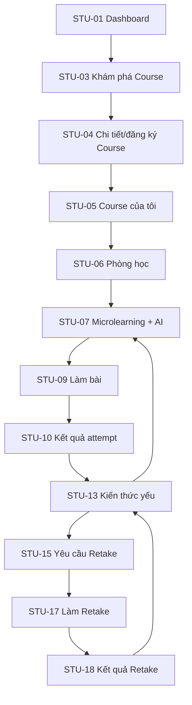
```mermaid
flowchart TD
    S01["STU-01 Dashboard"]
    S03["STU-03 Khám phá Course"]
    S04["STU-04 Chi tiết/đăng ký Course"]
    S05["STU-05 Course của tôi"]
    S06["STU-06 Phòng học"]
    S07["STU-07 Microlearning + AI"]
    S09["STU-09 Làm bài"]
    S10["STU-10 Kết quả attempt"]
    S13["STU-13 Kiến thức yếu"]
    S15["STU-15 Yêu cầu Retake"]
    S17["STU-17 Làm Retake"]
    S18["STU-18 Kết quả Retake"]

    S01 --> S03 --> S04 --> S05 --> S06 --> S07
    S07 --> S09 --> S10
    S10 --> S13 --> S15 --> S17 --> S18
    S18 --> S13
    S13 --> S07
```

Các nhánh phụ bắt buộc:

| Điểm vào | Chuỗi màn hình | Mục đích |
|---|---|---|
| STU-01 | STU-02 → STU-03 → STU-04 | Chọn ngành, tìm và đăng ký Course |
| STU-01/STU-20 | STU-22 → STU-21 → STU-23 | Tham gia lớp, xem lớp và buổi học |
| STU-07/STU-09 | AI Drawer ↔ STU-08 | Hỏi AI và mở lịch sử đúng ngữ cảnh |
| STU-10 | STU-11 → STU-07 | Xem lỗi sai, luyện câu tương tự, học lại |
| STU-12 | STU-19 → STU-10/STU-24 | Xem tiến độ và lịch sử các loại bài |
| STU-01/STU-04 | STU-25 → STU-26 → STU-27 → STU-04 | Assessment đầu vào và Course đề xuất |

### 16.2. Không gian Teacher

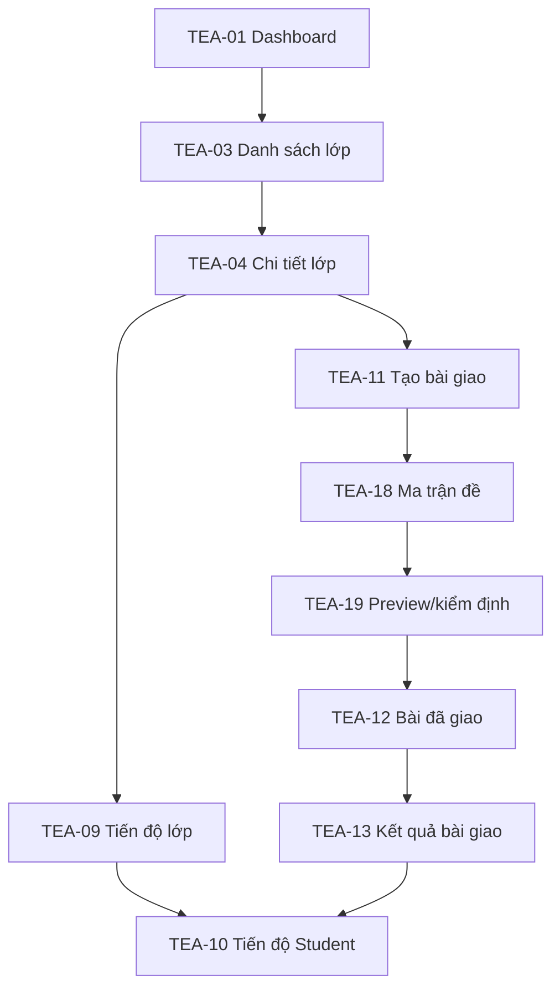
```mermaid
flowchart TD
    T01["TEA-01 Dashboard"]
    T03["TEA-03 Danh sách lớp"]
    T04["TEA-04 Chi tiết lớp"]
    T09["TEA-09 Tiến độ lớp"]
    T10["TEA-10 Tiến độ Student"]
    T11["TEA-11 Tạo bài giao"]
    T18["TEA-18 Ma trận đề"]
    T19["TEA-19 Preview/kiểm định"]
    T12["TEA-12 Bài đã giao"]
    T13["TEA-13 Kết quả bài giao"]

    T01 --> T03 --> T04
    T04 --> T09 --> T10
    T04 --> T11
    T11 --> T18 --> T19 --> T12 --> T13
    T13 --> T10
```

Các nhánh phụ bắt buộc:

| Điểm vào | Chuỗi màn hình | Mục đích |
|---|---|---|
| TEA-03 | TEA-05 → TEA-06 → TEA-04 | Tạo/cấu hình lớp từ Course được quyền dạy |
| TEA-04 | TEA-07 → TEA-08 | Quản lý thành viên, lời mời, yêu cầu tham gia và buổi học |
| TEA-01 | TEA-14 → TEA-15 | Duyệt điểm/nhận xét AI chấm tự luận |
| TEA-01 | TEA-16 → TEA-17 → TEA-18/19 | Quản lý câu hỏi cá nhân và soạn câu hỏi |
| TEA-16 | TEA-22 | Import/export câu hỏi bất đồng bộ |
| TEA-01 | TEA-20 → TEA-21 | Duyệt cây kho và xem/tải học liệu |
| TEA-01 | TEA-23 | Xem gói, nâng cấp Pro và trạng thái thanh toán |

### 16.3. Không gian Admin

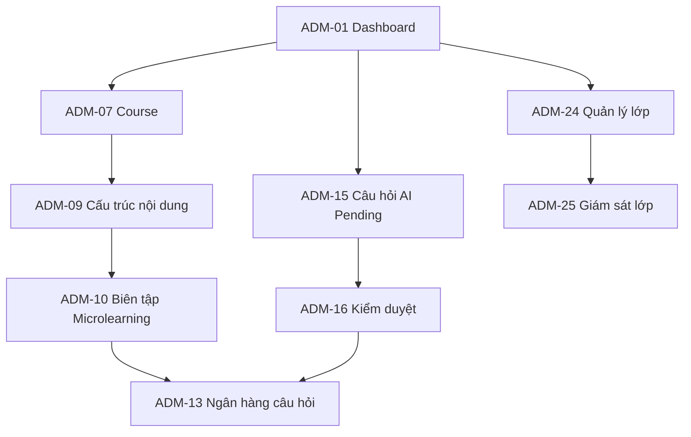
```mermaid
flowchart TD
    A01["ADM-01 Dashboard"]
    A07["ADM-07 Course"]
    A09["ADM-09 Cấu trúc nội dung"]
    A10["ADM-10 Biên tập Microlearning"]
    A13["ADM-13 Ngân hàng câu hỏi"]
    A15["ADM-15 Câu hỏi AI Pending"]
    A16["ADM-16 Kiểm duyệt"]
    A24["ADM-24 Quản lý lớp"]
    A25["ADM-25 Giám sát lớp"]

    A01 --> A07 --> A09 --> A10
    A10 --> A13
    A01 --> A15 --> A16 --> A13
    A01 --> A24 --> A25
```

Các nhánh phụ bắt buộc:

| Điểm vào | Chuỗi màn hình | Mục đích |
|---|---|---|
| ADM-01 | ADM-02 → ADM-03 → ADM-04/05 | Quản lý user/quyền và truy vết |
| ADM-01 | ADM-06 → ADM-07 → ADM-08/09 | Quản lý ngành và Course |
| ADM-10 | ADM-11 → ADM-12 | Quản lý/kiểm định tài nguyên |
| ADM-13 | ADM-14 | Tạo/sửa câu hỏi chính thức |
| ADM-01 | ADM-17 | Chuẩn Assessment và ngưỡng pass |
| ADM-01 | ADM-18 → ADM-19 | Cấu hình và giám sát AI |
| ADM-01 | ADM-20 → ADM-12/04 | Quản trị kho Teacher và audit |
| ADM-01 | ADM-21 → ADM-22 → ADM-04 | Xử lý report/khiếu nại và truy vết |
| ADM-01 | ADM-23 → ADM-03/04 | Quản lý gói Teacher và cấu hình |

## 17. Cross-role Screen Flow – liên kết màn hình giữa Student, Teacher và Admin

### 17.1. Course và Microlearning

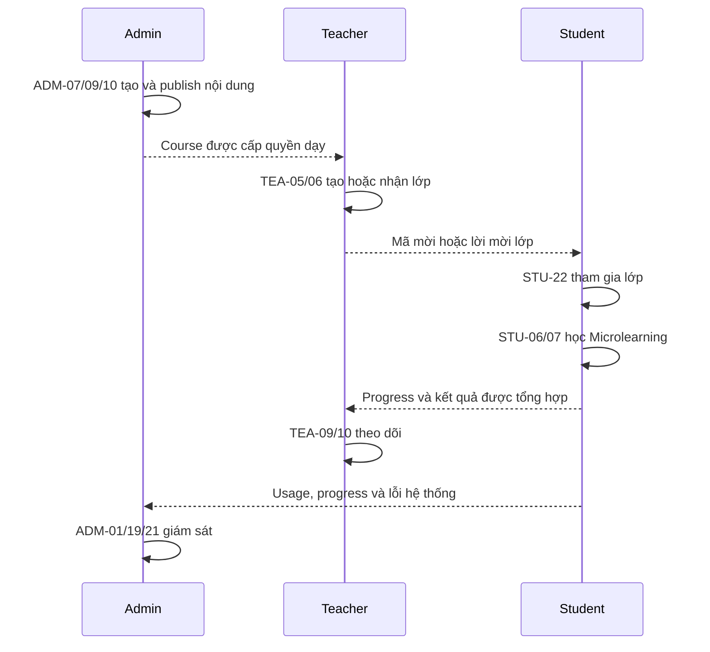
```mermaid
sequenceDiagram
    participant A as Admin
    participant T as Teacher
    participant S as Student
    A->>A: ADM-07/09/10 tạo và publish nội dung
    A-->>T: Course được cấp quyền dạy
    T->>T: TEA-05/06 tạo hoặc nhận lớp
    T-->>S: Mã mời hoặc lời mời lớp
    S->>S: STU-22 tham gia lớp
    S->>S: STU-06/07 học Microlearning
    S-->>T: Progress và kết quả được tổng hợp
    T->>T: TEA-09/10 theo dõi
    S-->>A: Usage, progress và lỗi hệ thống
    A->>A: ADM-01/19/21 giám sát
```

| Bước | Màn hình thực hiện | Thao tác | Dữ liệu tạo/cập nhật | Màn hình nhận/đích |
|---:|---|---|---|---|
| 1 | ADM-07 → ADM-10 | Tạo Course và cấu trúc đến Microlearning | Course Structure, Content, Publish State | TEA-02; STU-03/04 |
| 2 | TEA-05/06 | Chọn Course được quyền dạy, cấu hình lớp | Class, Teacher Assignment, Invite Code | TEA-04; STU-22 |
| 3 | STU-22 | Tham gia lớp | Class Membership/Join Request | STU-21; TEA-07 nếu cần duyệt |
| 4 | STU-06/07 | Học Kiến thức, Mô phỏng, Bài tập; hỏi AI | Microlearning Progress, AI Conversation, Usage | STU-12; TEA-09/10; ADM-19 |
| 5 | TEA-09/10 | Xem tiến độ và điểm yếu | Không sửa dữ liệu gốc; đọc dữ liệu tổng hợp | TEA-11 nếu cần giao thêm bài |
| 6 | ADM-18/19 | Quản lý RAG/quota và giám sát AI | AI Config, Usage/Cost Log | AI Drawer tại STU-07/09/11 |

### 17.2. Giao bài, làm bài và theo dõi kết quả

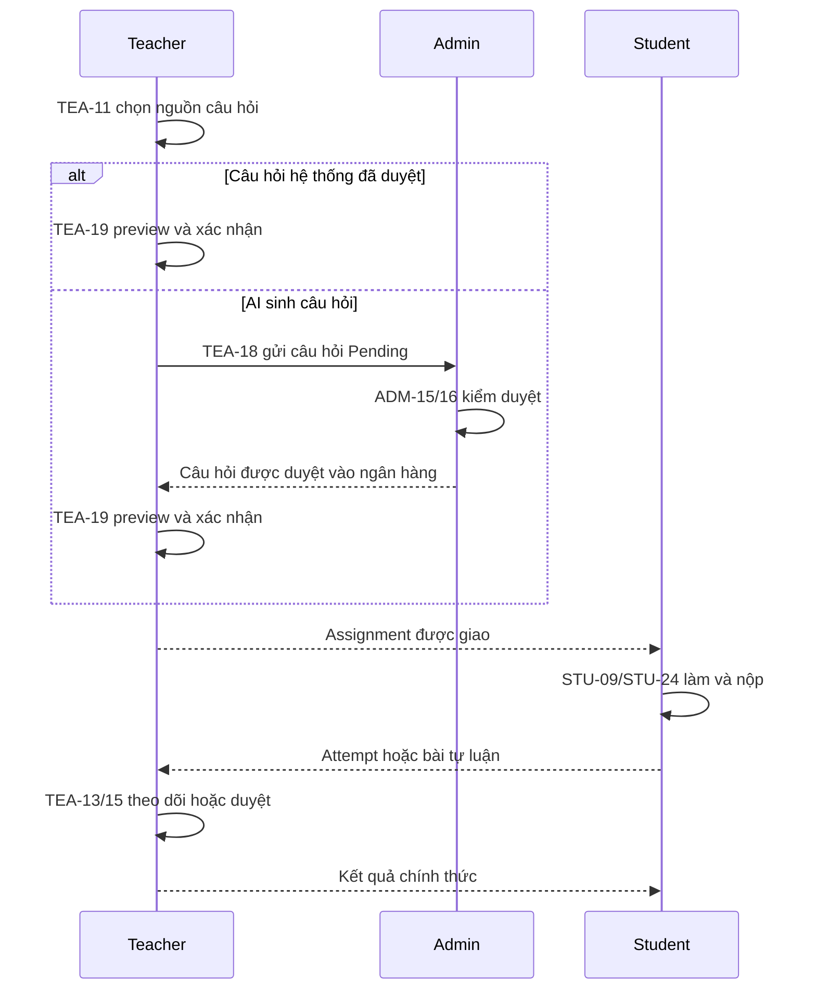
```mermaid
sequenceDiagram
    participant T as Teacher
    participant A as Admin
    participant S as Student
    T->>T: TEA-11 chọn nguồn câu hỏi
    alt Câu hỏi hệ thống đã duyệt
        T->>T: TEA-19 preview và xác nhận
    else AI sinh câu hỏi
        T->>A: TEA-18 gửi câu hỏi Pending
        A->>A: ADM-15/16 kiểm duyệt
        A-->>T: Câu hỏi được duyệt vào ngân hàng
        T->>T: TEA-19 preview và xác nhận
    end
    T-->>S: Assignment được giao
    S->>S: STU-09/STU-24 làm và nộp
    S-->>T: Attempt hoặc bài tự luận
    T->>T: TEA-13/15 theo dõi hoặc duyệt
    T-->>S: Kết quả chính thức
```

| Bước | Role/màn hình nguồn | Dữ liệu chuyển giao | Role/màn hình đích | Kết quả tiếp theo |
|---:|---|---|---|---|
| 1 | Teacher – TEA-11/16/18 | Cấu hình bài, ma trận hoặc câu hỏi AI | Admin – ADM-15/16 nếu Pending | Duyệt hoặc từ chối có lý do |
| 2 | Admin – ADM-16 | Question Approved | Teacher – TEA-16/19 | Preview đề và xác nhận kiểm định |
| 3 | Teacher – TEA-19 | Assignment, deadline, target class/student | Student – STU-01/09/24 | Student nhận và làm bài |
| 4 | Student – STU-09 | Answers, Attempt, Score | Student – STU-10; Teacher – TEA-12/13 | Xem kết quả và tiến độ |
| 5 | Student – STU-24 | Essay Submission | Teacher – TEA-14/15 | Duyệt/sửa AI draft |
| 6 | Teacher – TEA-15 | Official Grade, Comment | Student – STU-24/19 | Xem kết quả chính thức |
| 7 | Teacher – TEA-10/13 | Override + lý do | Student – STU-10/12; Admin – ADM-04 | Điểm mới hiển thị và audit giữ điểm cũ |

### 17.3. Kiến thức yếu và AI Retake

| Bước | Màn hình | Xử lý | Dữ liệu dùng/tạo | Nơi sử dụng tiếp |
|---:|---|---|---|---|
| 1 | STU-09/17 | Student nộp câu trả lời | Answer, correctness, knowledge mapping | STU-10/18 |
| 2 | Hệ thống | Tổng hợp lỗi theo Microlearning | Weak Knowledge, Learning Profile | STU-13/14; TEA-09/10 |
| 3 | STU-13/14 | Student chọn học lại hoặc Retake | Weak Knowledge Selection | STU-07 hoặc STU-15 |
| 4 | STU-15/16 | Yêu cầu AI sinh bộ Retake | Retake Job, quota, 10 câu hỏi | ADM-19 giám sát; STU-17 nhận thông báo |
| 5 | STU-17/18 | Làm và xem kết quả | Retake Attempt, Profile Update | STU-13/14; TEA-09/10 |
| 6 | TEA-09/10 | Teacher xem tổng hợp lớp/cá nhân | Dữ liệu phân tích hệ thống, không phải AI mới sinh | TEA-11 giao thêm bài nếu cần |

### 17.4. Report và khiếu nại

| Bước | Màn hình nguồn | Thao tác/dữ liệu | Màn hình đích | Kết quả |
|---:|---|---|---|---|
| 1 | Bất kỳ màn Student/Teacher | Mở COM-04, gửi loại lỗi + mô tả + context | ADM-21 | Ticket mới được định tuyến |
| 2 | ADM-21/22 | Đọc, phân công, đối chiếu entity/audit | ADM-04/05 hoặc màn entity | Có bằng chứng xử lý |
| 3 | ADM-22 | Phản hồi, đóng hoặc mở lại | Màn nguồn/thông báo của người gửi | Trạng thái ticket cập nhật |

## 18. Ma trận quan hệ dữ liệu liên vai trò

Quy ước: **C** = Create, **R** = Read, **U** = Update/decision, **A** = Approve, **M** = Monitor.

| Đối tượng dữ liệu | Student | Teacher | Admin | Màn hình tạo | Màn hình tiêu thụ chính | Quy tắc |
|---|---|---|---|---|---|---|
| User/Profile | C/R/U bản thân | C/R/U bản thân | R/U/M toàn quyền | AUTH-01, COM-01 | Dashboard theo role, ADM-02/03 | Teacher bị giới hạn theo khối/môn được cấp |
| Course Structure | R nội dung publish | R Course được cấp | C/R/U/A | ADM-07/09/10 | STU-03–07, TEA-02/05 | Teacher không tạo Lesson |
| Learning Resource | R khi bài mở | R/tải theo quyền | C/R/U/A/M | ADM-11/12/20 | STU-07, TEA-20/21 | Kho Teacher tách khỏi progress; Paid không public |
| Class | R khi là thành viên | C/R/U theo lớp phụ trách | C/R/U/M theo tổ chức | TEA-05/06 hoặc ADM-24 | STU-20–23, TEA-03–08, ADM-24/25 | Class phải tham chiếu Course publish |
| Membership/Invite | C yêu cầu tham gia | C/R/U lời mời và duyệt | R/M/can thiệp | STU-22, TEA-07 | STU-21, TEA-07, ADM-25 | Tuân theo Open/Approval/Invite |
| Microlearning Progress | C/U qua hoạt động | R/M; override theo quyền | R/M | STU-07/09 | STU-06/12, TEA-09/10, ADM-01 | Completed không bị hạ khi attempt sau thấp hơn |
| AI Conversation | C/R bản thân | M nội dung trong phạm vi hỗ trợ | R/M/cấu hình retention | AI Drawer, STU-08 | STU-08, ADM-18/19 | Gắn Course/Lesson/Microlearning/tab/question |
| Assignment | R/làm khi được giao | C/R/U | R/M | TEA-11/19 | STU-09/24, TEA-12/13 | Teacher phải xác nhận kiểm định trước khi giao |
| Attempt/Result | C/R bản thân | R/M/U override | R/M/xuất báo cáo | STU-09/17/24 | STU-10/12/19, TEA-09/13, ADM-01 | Override lưu điểm cũ, mới, actor và lý do |
| Weak Knowledge/Profile | R bản thân | R/M theo lớp | R/M | Hệ thống từ Attempt | STU-13/14, TEA-09/10 | Không cho Teacher sửa trực tiếp dữ liệu suy ra |
| Retake | C/R bản thân | R/M kết quả | M tài nguyên AI | STU-15–18 | STU-13/18, TEA-09/10, ADM-19 | 3 lần/ngày, xử lý bất đồng bộ |
| Essay Grade | R kết quả chính thức | R/U/A bản nháp AI | R/M/cấu hình rubric | STU-24 + AI draft | TEA-14/15, STU-24 | Student không xem draft như điểm chính thức |
| Question | Không truy cập kho | C/R/U câu sở hữu; dùng câu được cấp | C/R/U/A toàn hệ thống | TEA-17/18, ADM-14 | TEA-11/16/19, ADM-13 | AI Question Pending không được dùng chính thức |
| Exam Matrix | Nhận đề đã phân phối | C/R/U | R/M/cấu hình chuẩn | TEA-18 | TEA-19, STU-09 | Thiếu câu phải dừng và cảnh báo |
| Report Ticket | C/R ticket bản thân | C/R ticket bản thân | R/U/M | COM-04 | ADM-21/22 | Luôn lưu context màn nguồn |
| Audit Log | Không truy cập | Chỉ thấy kết quả cần thiết | R/M | Tự động từ hành động nhạy cảm | ADM-04/05 | Bất biến đối với người dùng nghiệp vụ |

## 19. Bảng chuyển giao nghiệp vụ giữa các role

| ID | Role nguồn | Sự kiện/màn hình nguồn | Dữ liệu chuyển giao | Role nhận và màn hình nhận | Hành động tiếp theo |
|---|---|---|---|---|---|
| XR-01 | Admin | Publish tại ADM-09/10 | Course + Microlearning đã duyệt | Teacher TEA-02/05; Student STU-03/04 | Teacher tạo lớp; Student đăng ký/học |
| XR-02 | Admin | Phân công tại ADM-24/25 | Class + Teacher Assignment | Teacher TEA-03/04 | Teacher cấu hình/vận hành lớp |
| XR-03 | Teacher | Mời/duyệt tại TEA-07 | Invite hoặc Membership Approval | Student STU-20/21/22 | Student vào lớp |
| XR-04 | Student | Học tại STU-07/09 | Progress + Attempt | Teacher TEA-09/10/13 | Theo dõi hoặc giao thêm bài |
| XR-05 | Student | Hỏi AI tại STU-07/09/11 | Conversation + Usage + Report | Admin ADM-18/19/21 khi cần | Giám sát quota/RAG hoặc xử lý lỗi |
| XR-06 | Teacher | AI sinh câu tại TEA-18 | Pending Question + context | Admin ADM-15/16 | Duyệt/từ chối |
| XR-07 | Admin | Duyệt tại ADM-16 | Approved Question | Teacher TEA-16/19 | Dùng trong đề/bài giao |
| XR-08 | Teacher | Giao tại TEA-19 | Assignment + deadline + target | Student STU-01/09/24 | Làm và nộp |
| XR-09 | Student | Nộp tại STU-24 | Essay Submission | Teacher TEA-14/15 | Duyệt điểm AI |
| XR-10 | Teacher | Công bố tại TEA-15 | Official Grade + feedback | Student STU-24/19 | Xem kết quả |
| XR-11 | Student/System | Attempt tại STU-09/17 | Weak Knowledge + Profile | Student STU-13/14; Teacher TEA-09/10 | Học lại, Retake hoặc giao bổ sung |
| XR-12 | Student/Teacher | Report tại COM-04 | Ticket + screen context | Admin ADM-21/22 | Xử lý và phản hồi |

## 20. Cách đọc tài liệu khi thiết kế hoặc phát triển

Đối với mỗi chức năng, người đọc thực hiện theo thứ tự:

1. Tìm nhánh nghiệp vụ tại **mục 15**.
2. Xác định toàn bộ màn hình của role tại **mục 16**.
3. Đọc đặc tả từng màn hình tại **mục 6–10**.
4. Nếu dữ liệu đi qua nhiều role, đọc flow tương ứng tại **mục 17**.
5. Kiểm tra quyền và chủ sở hữu dữ liệu tại **mục 18**.
6. Kiểm tra điểm bàn giao cụ thể bằng mã `XR-*` tại **mục 19**.

Ví dụ flow `Microlearning + AI`:

`ADM-07/09/10 tạo nội dung → TEA-05/06 tổ chức lớp → STU-22 tham gia → STU-06/07 học và hỏi AI → STU-09/10 tạo kết quả → hệ thống cập nhật STU-13/14 → TEA-09/10 theo dõi → ADM-18/19 giám sát AI`.

## 21. Kết luận sử dụng

## 22. Sitemap cây màn hình có hành động điều hướng

Phần này là lớp trình bày chính của sitemap. Mỗi node biểu diễn một màn hình hoặc một cụm màn hình có cùng mục đích. Nhãn trên đường nối cho biết người dùng phải thực hiện thao tác gì hoặc hệ thống phải thỏa điều kiện nào để đi đến node kế tiếp.

Quy ước:

- Node xanh dương: Student.
- Node tím: Teacher.
- Node cam: Admin.
- Node xám: công khai, xác thực hoặc dùng chung.
- Mũi tên liền: điều hướng trực tiếp trên giao diện.
- Mũi tên nét đứt: dữ liệu hoặc kết quả được chuyển sang role khác.
- Node hình thoi: điều kiện nghiệp vụ.

### 22.1. Cây toàn hệ thống

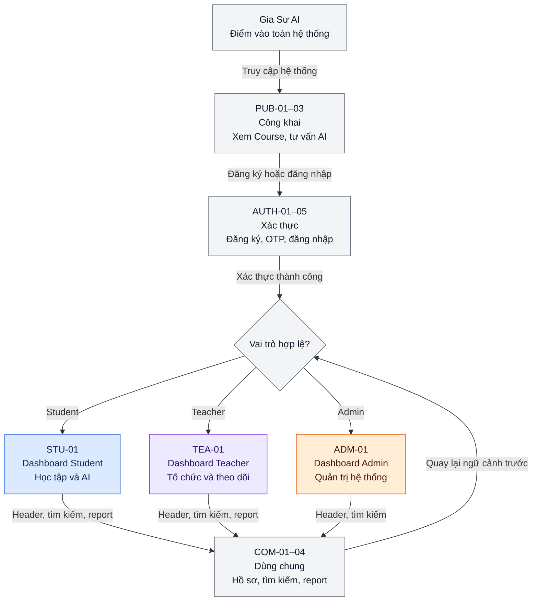
```mermaid
flowchart TD
    ROOT["Gia Sư AI<br/>Điểm vào toàn hệ thống"]
    PUB["PUB-01–03<br/>Công khai<br/>Xem Course, tư vấn AI"]
    AUTH["AUTH-01–05<br/>Xác thực<br/>Đăng ký, OTP, đăng nhập"]
    ROLE{"Vai trò hợp lệ?"}
    STU["STU-01<br/>Dashboard Student<br/>Học tập và AI"]
    TEA["TEA-01<br/>Dashboard Teacher<br/>Tổ chức và theo dõi"]
    ADM["ADM-01<br/>Dashboard Admin<br/>Quản trị hệ thống"]
    COM["COM-01–04<br/>Dùng chung<br/>Hồ sơ, tìm kiếm, report"]

    ROOT -->|Truy cập hệ thống| PUB
    PUB -->|Đăng ký hoặc đăng nhập| AUTH
    AUTH -->|Xác thực thành công| ROLE
    ROLE -->|Student| STU
    ROLE -->|Teacher| TEA
    ROLE -->|Admin| ADM
    STU -->|Header, tìm kiếm, report| COM
    TEA -->|Header, tìm kiếm, report| COM
    ADM -->|Header, tìm kiếm| COM
    COM -->|Quay lại ngữ cảnh trước| ROLE

    classDef student fill:#dbeafe,stroke:#2563eb,color:#172554;
    classDef teacher fill:#ede9fe,stroke:#7c3aed,color:#2e1065;
    classDef admin fill:#ffedd5,stroke:#ea580c,color:#431407;
    classDef common fill:#f3f4f6,stroke:#6b7280,color:#111827;
    class STU student;
    class TEA teacher;
    class ADM admin;
    class ROOT,PUB,AUTH,ROLE,COM common;
```

### 22.2. Cây Student – Course, Microlearning và AI

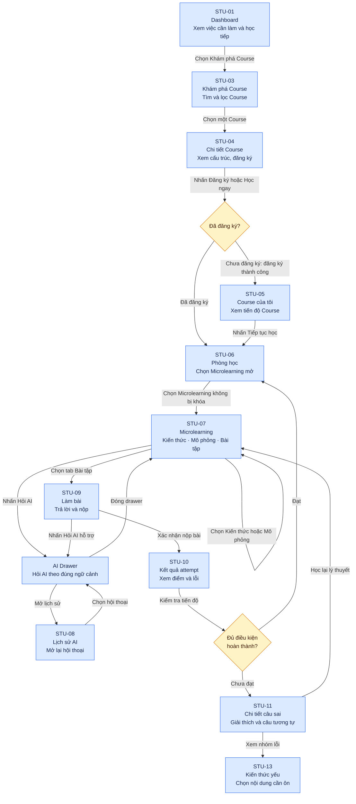
```mermaid
flowchart TD
    S01["STU-01<br/>Dashboard<br/>Xem việc cần làm và học tiếp"]
    S03["STU-03<br/>Khám phá Course<br/>Tìm và lọc Course"]
    S04["STU-04<br/>Chi tiết Course<br/>Xem cấu trúc, đăng ký"]
    OWN{"Đã đăng ký?"}
    S05["STU-05<br/>Course của tôi<br/>Xem tiến độ Course"]
    S06["STU-06<br/>Phòng học<br/>Chọn Microlearning mở"]
    S07["STU-07<br/>Microlearning<br/>Kiến thức · Mô phỏng · Bài tập"]
    AID["AI Drawer<br/>Hỏi AI theo đúng ngữ cảnh"]
    S08["STU-08<br/>Lịch sử AI<br/>Mở lại hội thoại"]
    S09["STU-09<br/>Làm bài<br/>Trả lời và nộp"]
    S10["STU-10<br/>Kết quả attempt<br/>Xem điểm và lỗi"]
    PASS{"Đủ điều kiện<br/>hoàn thành?"}
    S11["STU-11<br/>Chi tiết câu sai<br/>Giải thích và câu tương tự"]
    S13["STU-13<br/>Kiến thức yếu<br/>Chọn nội dung cần ôn"]

    S01 -->|Chọn Khám phá Course| S03
    S03 -->|Chọn một Course| S04
    S04 -->|Nhấn Đăng ký hoặc Học ngay| OWN
    OWN -->|Chưa đăng ký: đăng ký thành công| S05
    OWN -->|Đã đăng ký| S06
    S05 -->|Nhấn Tiếp tục học| S06
    S06 -->|Chọn Microlearning không bị khóa| S07
    S07 -->|Chọn Kiến thức hoặc Mô phỏng| S07
    S07 -->|Nhấn Hỏi AI| AID
    AID -->|Mở lịch sử| S08
    S08 -->|Chọn hội thoại| AID
    AID -->|Đóng drawer| S07
    S07 -->|Chọn tab Bài tập| S09
    S09 -->|Nhấn Hỏi AI hỗ trợ| AID
    S09 -->|Xác nhận nộp bài| S10
    S10 -->|Kiểm tra tiến độ| PASS
    PASS -->|Đạt| S06
    PASS -->|Chưa đạt| S11
    S11 -->|Học lại lý thuyết| S07
    S11 -->|Xem nhóm lỗi| S13

    classDef student fill:#dbeafe,stroke:#2563eb,color:#172554;
    classDef decision fill:#fef3c7,stroke:#d97706,color:#451a03;
    class S01,S03,S04,S05,S06,S07,AID,S08,S09,S10,S11,S13 student;
    class OWN,PASS decision;
```

Điều kiện hoàn thành một Microlearning:

1. Student đã học phần Kiến thức.
2. Student đã thực hiện phần Mô phỏng.
3. Student đã vượt bài tập theo ngưỡng cấu hình.
4. Student đã hoàn thành Assignment bắt buộc nếu Microlearning có gắn Assignment.
5. Teacher có thể mở khóa theo quyền, nhưng thao tác phải được ghi audit.

### 22.3. Cây Student – lớp học và Assessment đầu vào

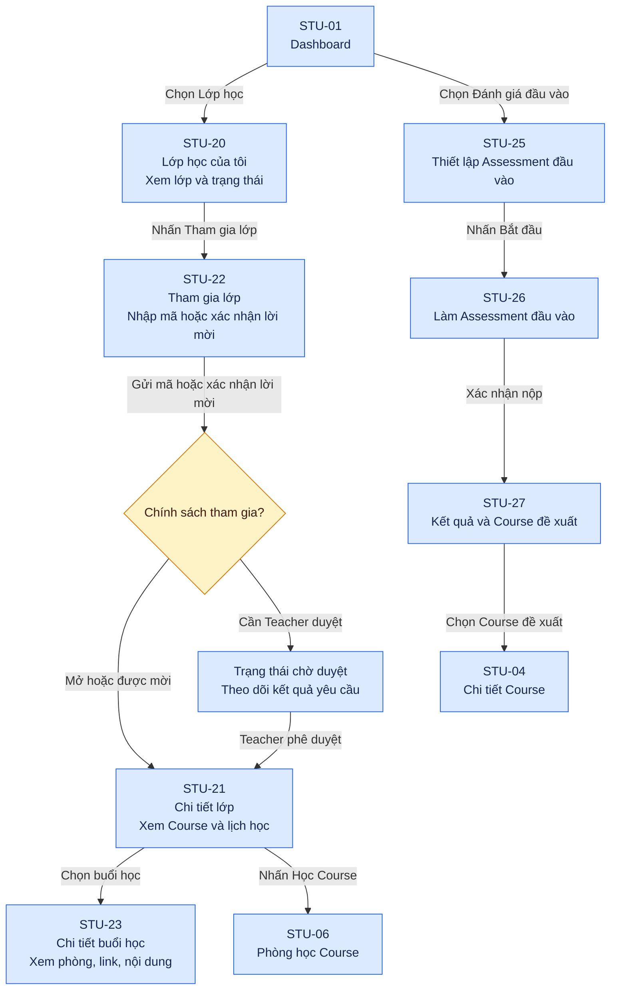
```mermaid
flowchart TD
    S01["STU-01<br/>Dashboard"]
    S20["STU-20<br/>Lớp học của tôi<br/>Xem lớp và trạng thái"]
    S22["STU-22<br/>Tham gia lớp<br/>Nhập mã hoặc xác nhận lời mời"]
    JOIN{"Chính sách tham gia?"}
    S21["STU-21<br/>Chi tiết lớp<br/>Xem Course và lịch học"]
    WAIT["Trạng thái chờ duyệt<br/>Theo dõi kết quả yêu cầu"]
    S23["STU-23<br/>Chi tiết buổi học<br/>Xem phòng, link, nội dung"]
    S06["STU-06<br/>Phòng học Course"]
    S25["STU-25<br/>Thiết lập Assessment đầu vào"]
    S26["STU-26<br/>Làm Assessment đầu vào"]
    S27["STU-27<br/>Kết quả và Course đề xuất"]
    S04["STU-04<br/>Chi tiết Course"]

    S01 -->|Chọn Lớp học| S20
    S20 -->|Nhấn Tham gia lớp| S22
    S22 -->|Gửi mã hoặc xác nhận lời mời| JOIN
    JOIN -->|Mở hoặc được mời| S21
    JOIN -->|Cần Teacher duyệt| WAIT
    WAIT -->|Teacher phê duyệt| S21
    S21 -->|Chọn buổi học| S23
    S21 -->|Nhấn Học Course| S06
    S01 -->|Chọn Đánh giá đầu vào| S25
    S25 -->|Nhấn Bắt đầu| S26
    S26 -->|Xác nhận nộp| S27
    S27 -->|Chọn Course đề xuất| S04

    classDef student fill:#dbeafe,stroke:#2563eb,color:#172554;
    classDef decision fill:#fef3c7,stroke:#d97706,color:#451a03;
    class S01,S20,S22,S21,WAIT,S23,S06,S25,S26,S27,S04 student;
    class JOIN decision;
```

### 22.4. Cây Student – kiến thức yếu và AI Retake

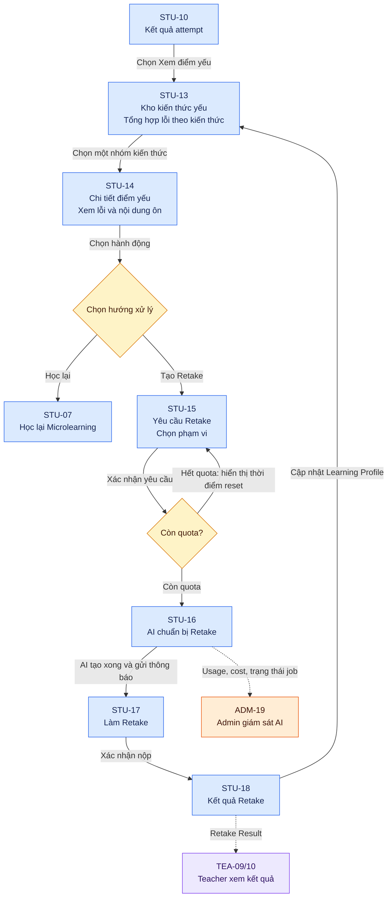
```mermaid
flowchart TD
    S10["STU-10<br/>Kết quả attempt"]
    S13["STU-13<br/>Kho kiến thức yếu<br/>Tổng hợp lỗi theo kiến thức"]
    S14["STU-14<br/>Chi tiết điểm yếu<br/>Xem lỗi và nội dung ôn"]
    CHOICE{"Chọn hướng xử lý"}
    S07["STU-07<br/>Học lại Microlearning"]
    S15["STU-15<br/>Yêu cầu Retake<br/>Chọn phạm vi"]
    QUOTA{"Còn quota?"}
    S16["STU-16<br/>AI chuẩn bị Retake"]
    S17["STU-17<br/>Làm Retake"]
    S18["STU-18<br/>Kết quả Retake"]
    T09["TEA-09/10<br/>Teacher xem kết quả"]
    A19["ADM-19<br/>Admin giám sát AI"]

    S10 -->|Chọn Xem điểm yếu| S13
    S13 -->|Chọn một nhóm kiến thức| S14
    S14 -->|Chọn hành động| CHOICE
    CHOICE -->|Học lại| S07
    CHOICE -->|Tạo Retake| S15
    S15 -->|Xác nhận yêu cầu| QUOTA
    QUOTA -->|Còn quota| S16
    QUOTA -->|Hết quota: hiển thị thời điểm reset| S15
    S16 -->|AI tạo xong và gửi thông báo| S17
    S17 -->|Xác nhận nộp| S18
    S18 -->|Cập nhật Learning Profile| S13
    S18 -.->|Retake Result| T09
    S16 -.->|Usage, cost, trạng thái job| A19

    classDef student fill:#dbeafe,stroke:#2563eb,color:#172554;
    classDef teacher fill:#ede9fe,stroke:#7c3aed,color:#2e1065;
    classDef admin fill:#ffedd5,stroke:#ea580c,color:#431407;
    classDef decision fill:#fef3c7,stroke:#d97706,color:#451a03;
    class S10,S13,S14,S07,S15,S16,S17,S18 student;
    class T09 teacher;
    class A19 admin;
    class CHOICE,QUOTA decision;
```

### 22.5. Cây Teacher – tạo lớp, vận hành và theo dõi

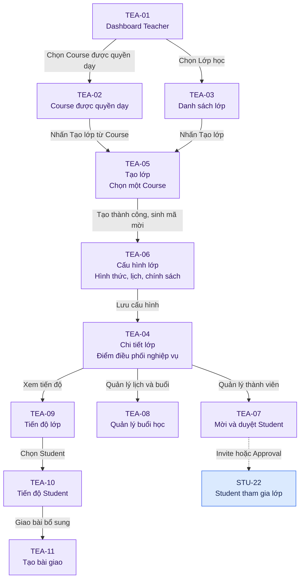
```mermaid
flowchart TD
    T01["TEA-01<br/>Dashboard Teacher"]
    T02["TEA-02<br/>Course được quyền dạy"]
    T03["TEA-03<br/>Danh sách lớp"]
    T05["TEA-05<br/>Tạo lớp<br/>Chọn một Course"]
    T06["TEA-06<br/>Cấu hình lớp<br/>Hình thức, lịch, chính sách"]
    T04["TEA-04<br/>Chi tiết lớp<br/>Điểm điều phối nghiệp vụ"]
    T07["TEA-07<br/>Mời và duyệt Student"]
    T08["TEA-08<br/>Quản lý buổi học"]
    T09["TEA-09<br/>Tiến độ lớp"]
    T10["TEA-10<br/>Tiến độ Student"]
    T11["TEA-11<br/>Tạo bài giao"]
    S22["STU-22<br/>Student tham gia lớp"]

    T01 -->|Chọn Course được quyền dạy| T02
    T01 -->|Chọn Lớp học| T03
    T02 -->|Nhấn Tạo lớp từ Course| T05
    T03 -->|Nhấn Tạo lớp| T05
    T05 -->|Tạo thành công, sinh mã mời| T06
    T06 -->|Lưu cấu hình| T04
    T04 -->|Quản lý thành viên| T07
    T04 -->|Quản lý lịch và buổi| T08
    T04 -->|Xem tiến độ| T09
    T09 -->|Chọn Student| T10
    T10 -->|Giao bài bổ sung| T11
    T07 -.->|Invite hoặc Approval| S22

    classDef student fill:#dbeafe,stroke:#2563eb,color:#172554;
    classDef teacher fill:#ede9fe,stroke:#7c3aed,color:#2e1065;
    class T01,T02,T03,T04,T05,T06,T07,T08,T09,T10,T11 teacher;
    class S22 student;
```

### 22.6. Cây Teacher – ngân hàng câu hỏi, ma trận và giao bài

```mermaid
flowchart TD
    T11["TEA-11<br/>Tạo bài giao<br/>Chọn lớp, phạm vi, deadline"]
    SOURCE{"Nguồn câu hỏi"}
    T16["TEA-16<br/>Kho câu hỏi Teacher"]
    T17["TEA-17<br/>Tạo/sửa câu hỏi"]
    T18["TEA-18<br/>Ma trận đề<br/>Chương và mức Bloom"]
    A15["ADM-15/16<br/>Admin kiểm duyệt câu AI"]
    ENOUGH{"Đủ câu hợp lệ?"}
    T19["TEA-19<br/>Preview đề<br/>Kiểm định nội dung"]
    CHECK{"Đã xác nhận<br/>chịu trách nhiệm?"}
    T12["TEA-12<br/>Bài đã giao"]
    S09["STU-09/24<br/>Student làm bài"]
    T13["TEA-13<br/>Kết quả bài giao"]
    T14["TEA-14/15<br/>Duyệt bài tự luận"]

    T11 -->|Chọn nguồn| SOURCE
    SOURCE -->|Ngân hàng| T16
    T16 -->|Tạo hoặc chỉnh câu| T17
    T17 -->|Lưu câu hợp lệ| T16
    SOURCE -->|Ma trận| T18
    SOURCE -->|AI sinh câu - Pro| T18
    T18 -.->|Câu AI ở trạng thái Pending| A15
    A15 -.->|Approved Question| T18
    T16 -->|Chọn câu| ENOUGH
    T18 -->|Kiểm tra ma trận| ENOUGH
    ENOUGH -->|Đủ| T19
    ENOUGH -->|Thiếu: bổ sung hoặc sửa ma trận| T17
    T19 -->|Nhấn Giao bài| CHECK
    CHECK -->|Đã xác nhận| T12
    CHECK -->|Chưa xác nhận| T19
    T12 -.->|Assignment, deadline, target| S09
    S09 -.->|Attempt và Result| T13
    S09 -.->|Essay Submission| T14

    classDef student fill:#dbeafe,stroke:#2563eb,color:#172554;
    classDef teacher fill:#ede9fe,stroke:#7c3aed,color:#2e1065;
    classDef admin fill:#ffedd5,stroke:#ea580c,color:#431407;
    classDef decision fill:#fef3c7,stroke:#d97706,color:#451a03;
    class T11,T16,T17,T18,T19,T12,T13,T14 teacher;
    class A15 admin;
    class S09 student;
    class SOURCE,ENOUGH,CHECK decision;
```

### 22.7. Cây Admin – nội dung học tập và kho học liệu

```mermaid
flowchart TD
    A01["ADM-01<br/>Dashboard Admin"]
    A06["ADM-06<br/>Quản lý ngành/môn"]
    A07["ADM-07<br/>Danh sách Course"]
    A08["ADM-08<br/>Tạo/sửa Course"]
    A09["ADM-09<br/>Cấu trúc Course<br/>Module · Lesson · Microlearning"]
    A10["ADM-10<br/>Biên tập Microlearning<br/>Kiến thức · Mô phỏng · Bài tập"]
    A11["ADM-11<br/>Kho Learning Resource"]
    A12["ADM-12<br/>Chi tiết và kiểm định Resource"]
    VALID{"Nội dung hợp lệ?"}
    T02["TEA-02<br/>Teacher nhận Course được cấp"]
    S03["STU-03/04<br/>Student thấy Course publish"]

    A01 -->|Chọn Nội dung học tập| A06
    A06 -->|Chọn ngành hoặc môn| A07
    A07 -->|Tạo hoặc sửa Course| A08
    A08 -->|Lưu thông tin cơ bản| A09
    A09 -->|Chọn Microlearning| A10
    A10 -->|Gắn Resource| A11
    A11 -->|Upload hoặc chọn Resource| A12
    A12 -->|Kiểm định| VALID
    VALID -->|Không đạt: trả về chỉnh sửa| A10
    VALID -->|Đạt và publish Course| T02
    VALID -->|Đạt và publish Course| S03

    classDef student fill:#dbeafe,stroke:#2563eb,color:#172554;
    classDef teacher fill:#ede9fe,stroke:#7c3aed,color:#2e1065;
    classDef admin fill:#ffedd5,stroke:#ea580c,color:#431407;
    classDef decision fill:#fef3c7,stroke:#d97706,color:#451a03;
    class A01,A06,A07,A08,A09,A10,A11,A12 admin;
    class T02 teacher;
    class S03 student;
    class VALID decision;
```

### 22.8. Cây Admin – tài khoản, AI, report và giám sát lớp

```mermaid
flowchart TD
    A01["ADM-01<br/>Dashboard Admin"]
    A02["ADM-02/03<br/>Tài khoản và chi tiết User"]
    A04["ADM-04/05<br/>Audit và lịch sử hoạt động"]
    A18["ADM-18<br/>Cấu hình AI, RAG, quota"]
    A19["ADM-19<br/>Giám sát usage, cost, job"]
    A21["ADM-21<br/>Danh sách Report"]
    A22["ADM-22<br/>Chi tiết xử lý Report"]
    A24["ADM-24<br/>Quản lý lớp toàn hệ thống"]
    A25["ADM-25<br/>Giám sát chi tiết lớp"]
    SOURCE{"Nguồn sự kiện"}

    A01 -->|Quản lý tài khoản| A02
    A02 -->|Xem thay đổi nhạy cảm| A04
    A01 -->|Cấu hình AI| A18
    A18 -->|Xem vận hành| A19
    A01 -->|Xử lý Report| A21
    A21 -->|Chọn ticket| A22
    A22 -->|Đối chiếu hành động| A04
    A01 -->|Quản lý lớp| A24
    A24 -->|Chọn lớp| A25
    SOURCE -->|Student hoặc Teacher gửi COM-04| A21
    SOURCE -->|Hệ thống ghi hành động nhạy cảm| A04
    SOURCE -->|AI tạo usage, cost, job| A19

    classDef admin fill:#ffedd5,stroke:#ea580c,color:#431407;
    classDef common fill:#f3f4f6,stroke:#6b7280,color:#111827;
    class A01,A02,A04,A18,A19,A21,A22,A24,A25 admin;
    class SOURCE common;
```

## 23. Phiếu đọc node và đường chuyển màn hình

Mỗi node trong sitemap phải được đọc theo sáu trường sau:

| Trường | Ý nghĩa |
|---|---|
| Mã màn hình | Định danh duy nhất để trace sang thiết kế, route, API và test case |
| Chức năng | Nghiệp vụ người dùng thực hiện tại màn hình |
| Nguồn vào | Màn hình hoặc sự kiện đưa người dùng đến đây |
| Hành động chuyển | CTA, lựa chọn hoặc sự kiện hệ thống làm phát sinh điều hướng |
| Điều kiện | Quyền, trạng thái dữ liệu hoặc business rule phải thỏa |
| Màn hình đích và dữ liệu | Nơi tiếp tục flow và dữ liệu phải mang theo |

Ví dụ đọc nhánh Microlearning:

| Màn hình hiện tại | Chức năng tại chỗ | Hành động/điều kiện | Màn hình tiếp theo | Dữ liệu chuyển tiếp |
|---|---|---|---|---|
| STU-06 – Phòng học | Hiển thị cấu trúc và trạng thái khóa | Chọn Microlearning đang mở | STU-07 | `course_id`, `class_id`, `lesson_id`, `microlearning_id`, progress |
| STU-07 – Microlearning | Học Kiến thức, dùng Mô phỏng, ghi progress | Chọn tab Bài tập | STU-09 | Ngữ cảnh học và attempt nháp |
| STU-07 – Microlearning | Hỏi AI theo nội dung đang xem | Nhấn Hỏi AI, còn quota/cooldown hợp lệ | AI Drawer | Course, Lesson, Microlearning, tab, đoạn nội dung |
| STU-09 – Làm bài | Trả lời, lưu nháp, hỏi AI không lộ đáp án | Xác nhận nộp | STU-10 | Answers, thời gian, attempt, score |
| STU-10 – Kết quả | Xem điểm, câu đúng/sai và điểm cao nhất | Chọn một câu sai | STU-11 | `attempt_id`, `question_id`, knowledge mapping |
| STU-10 – Kết quả | Xác định bước học tiếp | Đạt đủ điều kiện hoàn thành | STU-06 hoặc STU-07 kế tiếp | Completion state, unlocked item |
| STU-11 – Chi tiết câu sai | Xem giải thích, câu tương tự | Chọn Xem kiến thức yếu | STU-13/14 | Knowledge node, lịch sử lỗi |

## 24. Ma trận hành động chuyển màn hình liên role

| ID | Role/màn hình thực hiện | Chức năng và hành động chốt | Dữ liệu tạo/chuyển | Role/màn hình tiếp tục |
|---|---|---|---|---|
| XF-01 | Admin – ADM-09/10 | Hoàn thiện cấu trúc và publish Course | Course, Module, Lesson, Microlearning, publish state | Teacher – TEA-02/05; Student – STU-03/04 |
| XF-02 | Teacher – TEA-05/06 | Tạo lớp từ một Course và lưu chính sách | Class, course reference, invite code, join policy | Student – STU-22; Admin – ADM-24/25 |
| XF-03 | Student – STU-22 | Gửi mã mời hoặc xác nhận lời mời | Membership hoặc Join Request | Teacher – TEA-07 nếu cần duyệt; Student – STU-21 khi hợp lệ |
| XF-04 | Student – STU-07/09 | Học, tương tác, hỏi AI và nộp bài | Progress, Conversation, Usage, Attempt | Student – STU-10/13; Teacher – TEA-09/10; Admin – ADM-19 |
| XF-05 | Teacher – TEA-18 | Yêu cầu AI sinh câu theo ma trận | Pending Question, Bloom, knowledge scope | Admin – ADM-15/16 |
| XF-06 | Admin – ADM-16 | Phê duyệt hoặc từ chối câu AI | Approval state, reviewer, reason | Teacher – TEA-16/18/19 |
| XF-07 | Teacher – TEA-19 | Xác nhận kiểm định và giao đề | Assignment, target, deadline, question set | Student – STU-09/24 |
| XF-08 | Student – STU-09 | Nộp bài trắc nghiệm | Answers, Attempt, Score, Weak Knowledge input | Student – STU-10/13; Teacher – TEA-12/13 |
| XF-09 | Student – STU-24 | Nộp bài tự luận | Essay Submission, AI Draft Grade | Teacher – TEA-14/15 |
| XF-10 | Teacher – TEA-15 | Duyệt/sửa và công bố | Official Grade, feedback, approval actor | Student – STU-24/19 |
| XF-11 | Student – STU-15–18 | Yêu cầu, làm và nộp Retake | Retake Job, Retake Attempt, Profile Update | Teacher – TEA-09/10; Admin – ADM-19 |
| XF-12 | Student/Teacher – COM-04 | Gửi lỗi, AI ảo giác hoặc khiếu nại | Ticket, category, description, screen context | Admin – ADM-21/22 |

## 25. Checklist sử dụng sitemap

Trước khi duyệt thiết kế hoặc triển khai một màn hình, nhóm thực hiện phải kiểm tra:

1. Màn hình có mã duy nhất và nằm đúng role.
2. Có màn hình nguồn hoặc sự kiện mở màn hình.
3. Chức năng tại chỗ khớp tài liệu mô tả chức năng.
4. Mọi CTA đều có màn hình đích hoặc trạng thái kết quả.
5. Mọi nhánh điều kiện đều có đường thành công, thất bại và quay lại.
6. Dữ liệu chuyển tiếp có chủ sở hữu và phạm vi quyền rõ ràng.
7. Nếu dữ liệu đi sang role khác, có mã `XF-*` hoặc `XR-*` để trace.
8. Student không truy cập màn hình Teacher/Admin.
9. Teacher không tạo Lesson, không upload Learning Resource và chỉ đọc Course được cấp.
10. Không có màn hình Quản lý chứng nhận trong phiên bản này.
11. Microlearning luôn giữ ba phần Kiến thức, Mô phỏng và Bài tập.
12. AI trong Microlearning luôn nhận ngữ cảnh và không đưa đáp án trực tiếp trong bài tính điểm.

Sitemap này là kiến trúc màn hình mục tiêu để tiếp tục:

1. Chuẩn hóa User Flow riêng cho Student, Teacher và Admin.
2. Tạo Screen Flow chi tiết cho từng flow chính.
3. Đối chiếu route FE hiện tại với 87 màn hình mục tiêu.
4. Viết prompt cho Stitch theo từng cụm màn hình, không sinh rời rạc.
5. Lập ma trận `Feature → Screen → API → Permission → Test case`.

Ưu tiên thiết kế tiếp theo nên bắt đầu từ flow Học sinh:

`Dashboard → Khóa học → Phòng học → Microlearning → AI → Bài tập → Kết quả → Điểm yếu → Retake`.
