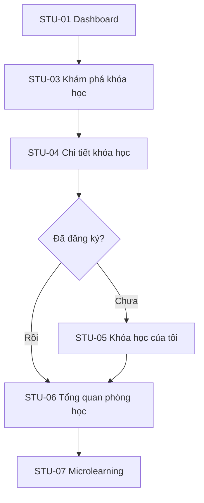
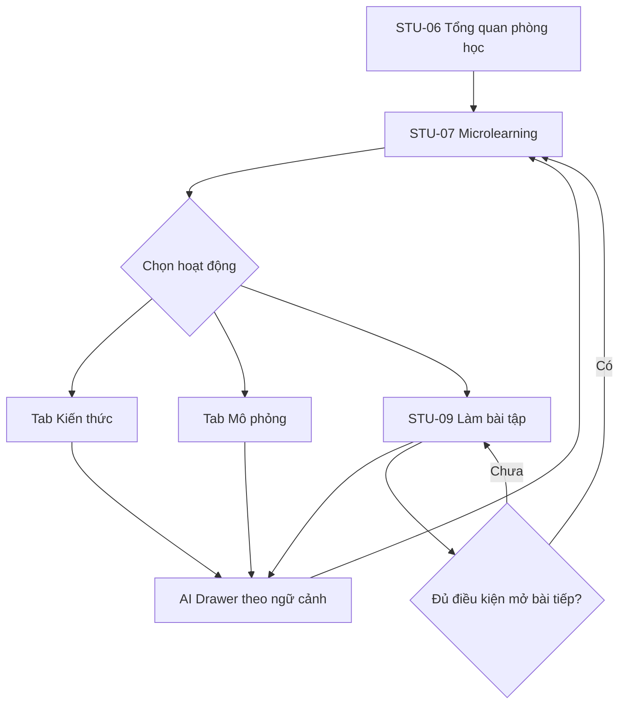
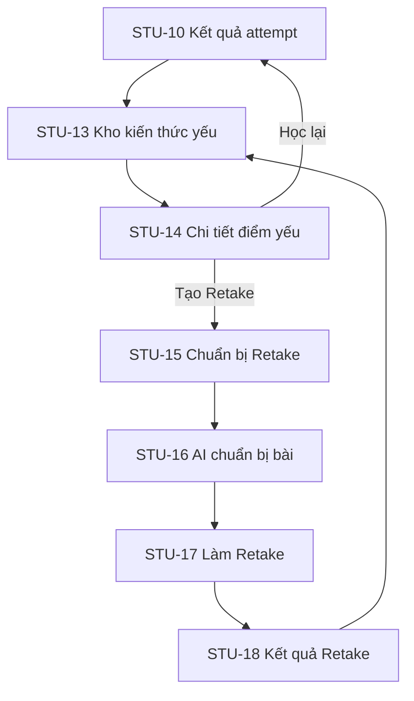
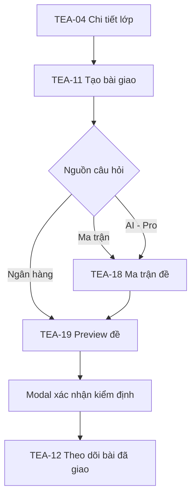
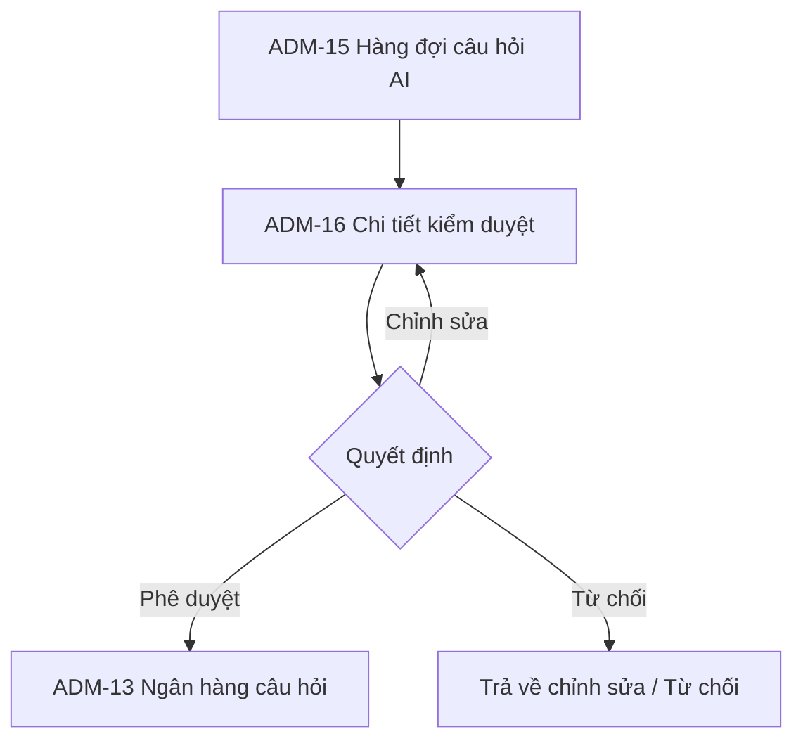
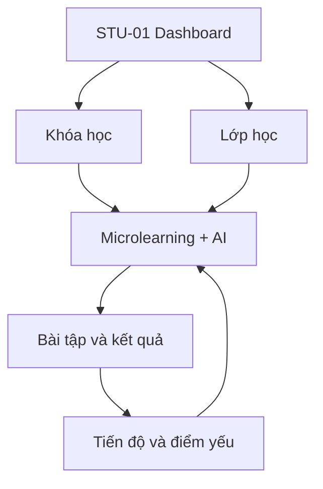
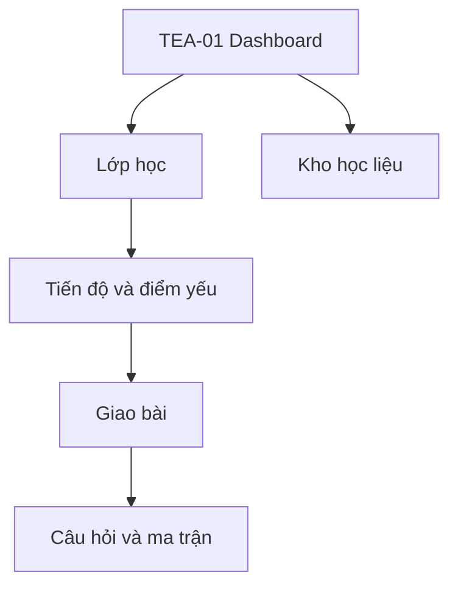
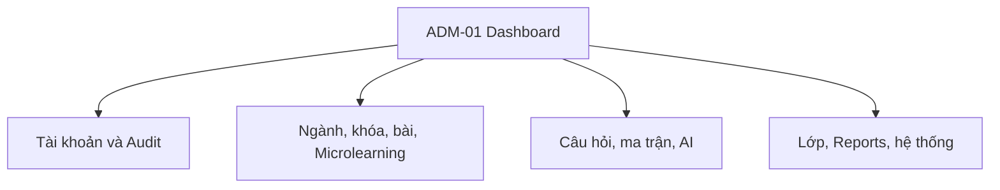

# SITEMAP VÀ SCREEN FLOW TOÀN HỆ THỐNG – GIA SƯ AI

**Phiên bản:** V1 – Phạm vi thiết kế mục tiêu  
**Ngày:** 30/07/2026  
**Nguồn nghiệp vụ chính:** `describe_feature_gia_su_ai(3).csv`  
**Nguồn đối chiếu:** FE/BE hiện tại và tài liệu `Phan_tich_man_hinh_va_Screen_Flow_Gia_Su_AI.md`

## 1. Mục tiêu tài liệu

Tài liệu xác định toàn bộ màn hình cần có để triển khai các chức năng của Gia Sư AI trong phiên bản hiện tại. Mỗi màn hình được mô tả theo chuỗi:

`Màn hình nguồn → Màn hình hiện tại → thao tác/điều kiện → Màn hình đích`

Tài liệu dùng cho Product Designer, UX/UI Designer, BA, SA, Frontend, Backend và QA để:

- Hiểu cấu trúc thông tin theo vai trò.
- Biết màn hình được truy cập từ đâu.
- Biết chức năng và hành động được thực hiện tại màn hình.
- Biết kết quả của từng hành động dẫn đến màn hình hoặc trạng thái nào.
- Phân biệt màn hình có route độc lập với modal, drawer, tab và trạng thái xử lý.

## 2. Phạm vi và nguyên tắc

### 2.1. Phạm vi thực hiện

Bao gồm:

- Xác thực, tài khoản và phân quyền.
- Nội dung học tập, khóa học, Lesson và Microlearning.
- Học sinh học bài và dùng AI trong Microlearning.
- Bài tập, kiểm tra, lịch sử attempt, kiến thức yếu và Retake.
- Lớp học và buổi học.
- AI Service, AI chấm tự luận và AI sinh câu hỏi.
- Ngân hàng câu hỏi và ma trận đề.
- Kho học liệu dành cho Giáo viên.
- Tìm kiếm, báo lỗi/khiếu nại, audit và cấu hình hệ thống.

Không bao gồm:

- Nhận, xem, tải, thống kê chứng nhận.
- Quản lý mẫu hoặc lịch sử cấp chứng nhận.

Các chức năng `3.4`, `3.5`, `3.6` liên quan đến chứng nhận không được đưa vào sitemap phiên bản này.

### 2.2. Nguyên tắc đếm màn hình

- Một màn hình được tính khi có mục đích nghiệp vụ riêng và cần route hoặc trạng thái điều hướng độc lập.
- Tab trong cùng một workspace không được tính là màn hình nếu không làm thay đổi ngữ cảnh nghiệp vụ.
- Modal/drawer không tính vào tổng màn hình, nhưng được ghi rõ là trạng thái bắt buộc nếu chứa bước xác nhận, nhập lý do hoặc thông tin quyết định.
- Màn hình lỗi, loading, empty, forbidden không tính riêng; mọi màn hình dữ liệu phải thiết kế các trạng thái này.
- Tài liệu mô tả kiến trúc màn hình mục tiêu, không chỉ phản ánh các route FE đang có.

### 2.3. Tổng số màn hình mục tiêu

| Phân hệ | Số màn hình |
|---|---:|
| Công khai và xác thực (`PUB`, `AUTH`) | 8 |
| Dùng chung theo tài khoản (`COM`) | 4 |
| Học sinh (`STU`) | 27 |
| Giáo viên (`TEA`) | 23 |
| Quản trị viên (`ADM`) | 25 |
| **Tổng cộng** | **87** |

> Con số 87 không bao gồm modal/drawer bắt buộc và không bao gồm bất kỳ màn hình quản lý chứng nhận nào.

## 3. Quy ước mã màn hình

| Tiền tố | Phạm vi |
|---|---|
| `PUB` | Màn hình công khai |
| `AUTH` | Xác thực và khôi phục tài khoản |
| `COM` | Màn hình dùng chung sau đăng nhập |
| `STU` | Học sinh/Học viên |
| `TEA` | Giáo viên |
| `ADM` | Quản trị viên |

## 4. Sitemap tổng thể theo vai trò

```mermaid
flowchart TD
    ROOT["Gia Sư AI"]
    PUBLIC["Công khai và xác thực"]
    STUDENT["Không gian Học sinh"]
    TEACHER["Không gian Giáo viên"]
    ADMIN["Không gian Quản trị"]

    ROOT --> PUBLIC
    ROOT --> STUDENT
    ROOT --> TEACHER
    ROOT --> ADMIN

    PUBLIC --> P1["Trang chủ và tư vấn AI"]
    PUBLIC --> P2["Đăng ký, OTP, đăng nhập"]
    PUBLIC --> P3["Khôi phục mật khẩu"]

    STUDENT --> S1["Khám phá và đăng ký học"]
    STUDENT --> S2["Lớp học và buổi học"]
    STUDENT --> S3["Microlearning và AI"]
    STUDENT --> S4["Bài tập, điểm yếu, Retake"]

    TEACHER --> T1["Lớp và tiến độ học sinh"]
    TEACHER --> T2["Giao bài và tự luận"]
    TEACHER --> T3["Câu hỏi và ma trận đề"]
    TEACHER --> T4["Kho học liệu và gói Pro"]

    ADMIN --> A1["Tài khoản, quyền và audit"]
    ADMIN --> A2["Nội dung và học liệu"]
    ADMIN --> A3["Câu hỏi, AI và Assessment"]
    ADMIN --> A4["Lớp, báo cáo và hệ thống"]
```

## 5. Các flow chính toàn hệ thống

### 5.1. Flow chính Học sinh – khám phá và bắt đầu học

### 5.2. Flow chính Học sinh – học bài và sử dụng AI trong Microlearning

Đây là flow chính độc lập của Học sinh, không được xem AI chỉ là tiện ích phụ.

Quy tắc flow:

1. Học sinh vào đúng `Course → Module → Lesson → Microlearning`.
2. Màn Microlearning luôn thể hiện ba khu vực: Kiến thức, Mô phỏng, Bài tập.
3. AI nhận ngữ cảnh gồm khóa học, module, lesson, microlearning, tab và câu hỏi hiện tại.
4. AI không cung cấp đáp án trực tiếp khi học sinh đang làm bài tính điểm.
5. Nếu trả lời sai, học sinh xem giải thích và có thể làm câu tương tự không tính điểm.
6. Chỉ khi đạt điều kiện hoàn thành hoặc được Giáo viên mở khóa, học sinh mới đi tiếp.

### 5.3. Flow chính Học sinh – điểm yếu và Retake

### 5.4. Flow chính Giáo viên – giao bài

### 5.5. Flow chính Admin – AI sinh câu hỏi và phê duyệt

## 6. Sitemap và đặc tả màn hình công khai, xác thực

| Mã | Màn hình | Mục đích và chức năng chính | Màn hình nguồn | Thao tác → màn hình đích |
|---|---|---|---|---|
| PUB-01 | Trang chủ | Giới thiệu hệ thống, khóa học nổi bật, ngành học, CTA đăng ký/đăng nhập, mở chatbot tư vấn. | Truy cập trực tiếp, logout | Chọn khóa → PUB-02; hỏi AI → PUB-03; đăng nhập → AUTH-04; đăng ký → AUTH-01 |
| PUB-02 | Chi tiết khóa học công khai | Xem mô tả, ngành, level, cấu trúc tổng quan và điều kiện học; không lộ nội dung bị khóa. | PUB-01, kết quả tìm kiếm công khai | Đăng ký học → AUTH-01 hoặc STU-04; quay lại → PUB-01 |
| PUB-03 | Chatbot tư vấn trang chủ | Tư vấn lộ trình, môn và khóa học; không giới hạn quota; hiển thị khóa được đề xuất. | PUB-01 | Chọn khóa đề xuất → PUB-02; đăng ký → AUTH-01; đóng chat → PUB-01 |
| AUTH-01 | Đăng ký tài khoản | Nhập thông tin, chọn Student/Teacher; Teacher chọn khối giảng dạy; chấp nhận điều khoản. | PUB-01, AUTH-04 | Gửi đăng ký → AUTH-02; đã có tài khoản → AUTH-04 |
| AUTH-02 | Xác thực OTP | Nhập OTP 6 số, đếm hiệu lực 5 phút, resend có giới hạn, hiển thị trạng thái khóa 15 phút. | AUTH-01, AUTH-05 | Đúng OTP → AUTH-03 hoặc AUTH-04; resend → ở lại; quá giới hạn → trạng thái khóa |
| AUTH-03 | Đăng ký thành công | Xác nhận tài khoản đã kích hoạt và hướng dẫn đăng nhập. | AUTH-02 | Đăng nhập → AUTH-04 |
| AUTH-04 | Đăng nhập | Xác thực tài khoản, xử lý session một thiết bị và thông báo kick-out phiên cũ theo cấu hình. | PUB-01, AUTH-03, COM-04, session hết hạn | Student → STU-01; Teacher → TEA-01; Admin → ADM-01; quên mật khẩu → AUTH-05 |
| AUTH-05 | Khôi phục mật khẩu | Flow ba bước: nhập email → AUTH-02 OTP → đặt mật khẩu mới; áp dụng resend và chống brute-force. | AUTH-04 | Gửi OTP → AUTH-02; đặt thành công → AUTH-04 |

### Trạng thái bắt buộc

- Email đã tồn tại/không tồn tại.
- OTP sai, hết hạn, đạt giới hạn resend hoặc bị khóa tạm thời.
- Tài khoản bị khóa/xóa.
- Phiên hiện tại bị đăng xuất do đăng nhập từ thiết bị khác.
- Sai vai trò hoặc route không có quyền truy cập.

## 7. Màn hình dùng chung sau đăng nhập

| Mã | Màn hình | Mục đích và chức năng chính | Màn hình nguồn | Thao tác → màn hình đích |
|---|---|---|---|---|
| COM-01 | Hồ sơ cá nhân | Xem/sửa họ tên, avatar và thông tin theo vai trò; Teacher xem khối/môn được cấp. | Header/menu tài khoản | Lưu → quay lại màn nguồn; bảo mật → COM-02; xóa tài khoản → modal xác nhận |
| COM-02 | Bảo mật và phiên đăng nhập | Xem lịch sử đăng nhập/đăng xuất, thời gian truy cập, đổi mật khẩu và phiên đang hoạt động. | COM-01 | Đổi mật khẩu → xác nhận tại chỗ; đăng xuất phiên → AUTH-04 |
| COM-03 | Kết quả tìm kiếm toàn văn | Hiển thị kết quả phân trang, sắp xếp tương đồng và bộ lọc đúng quyền từng vai trò. | Thanh tìm kiếm global | Student → STU-04/STU-07; Teacher → TEA-03/TEA-20; Admin → entity quản trị tương ứng |
| COM-04 | Report/Báo lỗi/Khiếu nại | Form chọn Lỗi hệ thống, AI ảo giác hoặc Khiếu nại điểm; nhập mô tả, đính kèm ngữ cảnh màn hiện tại. | Nút Report toàn cục | Gửi thành công → quay lại màn nguồn; chưa đăng nhập → AUTH-04 |

## 8. Sitemap Học sinh

### 8.1. Dashboard, ngành và khóa học

| Mã | Màn hình | Mục đích và chức năng chính | Màn hình nguồn | Thao tác → màn hình đích |
|---|---|---|---|---|
| STU-01 | Dashboard Học sinh | Tổng quan khóa đang học, lớp, tiến độ, retake còn lại, điểm cao nhất, lịch học gần nhất và gợi ý tiếp tục. | AUTH-04, logo/sidebar | Tiếp tục học → STU-06/07; tìm khóa → STU-03; vào lớp → STU-20; tiến độ → STU-12 |
| STU-02 | Danh sách ngành học | Tìm kiếm và xem các ngành; làm điểm vào để lọc khóa học. | STU-01, COM-03 | Chọn ngành → STU-03 với bộ lọc; tìm kiếm → kết quả tại chỗ |
| STU-03 | Khám phá khóa học | Tìm kiếm/lọc theo ngành, giáo viên và trạng thái Active; phân trang danh sách khóa công khai. | STU-01, STU-02, COM-03 | Chọn khóa → STU-04 |
| STU-04 | Chi tiết và đăng ký khóa học | Xem mô tả, cấu trúc Module/Lesson/Microlearning và điều kiện; đăng ký nhưng không tự hủy sau đăng ký. | STU-03, PUB-02, STU-23 | Đăng ký → STU-05 hoặc STU-06; đã sở hữu → STU-06; Assessment đầu vào → STU-22 |
| STU-05 | Khóa học của tôi | Danh sách đang học/đã hoàn thành, phần trăm tiến độ và hành động tiếp tục học. | STU-01, STU-04, sidebar | Chọn khóa → STU-06; tìm khóa mới → STU-03 |
| STU-06 | Tổng quan phòng học | Cấu trúc Course → Module → Lesson → Microlearning; thể hiện bài đã xong, hiện tại, bị khóa và lý do khóa. | STU-04, STU-05, STU-20 | Chọn Microlearning mở → STU-07; bài tập tổng hợp → STU-09; thông tin lớp → STU-21 |

### 8.2. Flow học bài và AI trong Microlearning

| Mã | Màn hình | Mục đích và chức năng chính | Màn hình nguồn | Thao tác → màn hình đích |
|---|---|---|---|---|
| STU-07 | Không gian Microlearning | Workspace học gồm ba tab bắt buộc: Kiến thức, Mô phỏng, Bài tập; breadcrumb đủ Course/Module/Lesson/Microlearning; lưu tiến độ. | STU-06, STU-14, STU-18 | Kiến thức/Mô phỏng → ở lại theo tab; bài tập → STU-09; lịch sử AI → STU-08; hoàn thành → Microlearning tiếp theo hoặc STU-06 |
| STU-08 | Lịch sử hội thoại AI | Danh sách và tìm lại cuộc trò chuyện theo khóa/bài; mở tiếp hội thoại có ngữ cảnh. | AI drawer tại STU-07/STU-09 | Chọn hội thoại → mở AI drawer tại đúng STU-07/STU-09; tạo hội thoại mới → quay lại màn gọi |
| STU-09 | Làm bài tập Microlearning | Nhiều loại câu hỏi, tự do điều hướng, lưu đáp án; AI hỗ trợ không đưa đáp án; hiển thị quota/cooldown. | STU-07, STU-10, STU-11 | Nộp bài → STU-10; hỏi AI → drawer tại chỗ; thoát có lưu nháp → STU-07 |
| STU-10 | Kết quả attempt | Điểm lần này, điểm cao nhất, trạng thái Completed; lưu Completed nếu từng đạt ngưỡng; danh sách đúng/sai. | STU-09 | Xem attempt → STU-11; làm lại → STU-09; xem điểm yếu → STU-13; bài tiếp → STU-07 |
| STU-11 | Chi tiết câu sai và luyện tương tự | Hiện đáp án sau nộp, giải thích tĩnh/AI, media; sinh câu tương đương không tính điểm. | STU-10, STU-14 | Làm câu tương tự → ở lại; hỏi AI → drawer; học lại lý thuyết → STU-07; quay lại → STU-10 |
| STU-12 | Tiến độ học tập cá nhân | Thống kê Lesson/Microlearning hoàn thành, tiến độ khóa, điểm cao nhất, attempt và retake còn lại. | STU-01, sidebar | Chọn khóa → STU-06; lịch sử attempt → STU-19; điểm yếu → STU-13 |

#### AI Drawer bắt buộc tại STU-07, STU-09, STU-11

AI Drawer không phải route riêng nhưng phải có:

- Ngữ cảnh đang học và nút mở lại lịch sử.
- Nội dung trả lời có trích nguồn học liệu khi phù hợp.
- Quota còn lại và bộ đếm cooldown.
- Trạng thái đang sinh, lỗi, hết quota và thử lại.
- Cơ chế chặn đáp án trực tiếp trong bài tính điểm.
- Nút Report phản hồi “AI ảo giác”.

### 8.3. Kho kiến thức yếu và Retake

| Mã | Màn hình | Mục đích và chức năng chính | Màn hình nguồn | Thao tác → màn hình đích |
|---|---|---|---|---|
| STU-13 | Kho kiến thức yếu | Tổng hợp câu sai theo Course/Module/Lesson/Microlearning, mức độ và xu hướng; đề xuất học lại hoặc Retake. | STU-10, STU-12, sidebar | Chọn điểm yếu → STU-14; tạo Retake tổng hợp → STU-15 |
| STU-14 | Chi tiết mảng kiến thức yếu | Xem các lỗi liên quan, lần sai, giải thích và nội dung cần ôn. | STU-13 | Học lại → STU-07; xem câu sai → STU-11; Retake → STU-15 |
| STU-15 | Cấu hình và yêu cầu Retake AI | Chọn phạm vi điểm yếu được phép, hiển thị quota 3 lần/ngày và xác nhận tạo bộ 10 dạng câu hỏi. | STU-13, STU-14, STU-18 | Xác nhận → STU-16; hết quota → ở lại với thời điểm reset |
| STU-16 | AI đang chuẩn bị Retake | Theo dõi tác vụ bất đồng bộ, cho phép rời màn hình và nhận thông báo khi xong. | STU-15, thông báo hệ thống | Hoàn tất → STU-17; lỗi → thử lại STU-15; rời đi → STU-01 |
| STU-17 | Làm bài Retake | Làm bộ câu hỏi tập trung điểm yếu, tự do điều hướng và nộp bài. | STU-16, thông báo | Nộp → STU-18; thoát/lưu → STU-13 |
| STU-18 | Kết quả Retake | Xem điểm, lỗi còn lại, thay đổi Learning Profile và hành động tiếp theo. | STU-17 | Điểm yếu → STU-13/14; học lại → STU-07; Retake mới → STU-15 |
| STU-19 | Lịch sử attempt và bài đã làm | Danh sách attempt chính thức/Retake/tự luận, điểm và trạng thái duyệt. | STU-12, STU-10 | Attempt trắc nghiệm → STU-10; tự luận → STU-24 |

### 8.4. Lớp học, buổi học và Assessment

| Mã | Màn hình | Mục đích và chức năng chính | Màn hình nguồn | Thao tác → màn hình đích |
|---|---|---|---|---|
| STU-20 | Lớp học của tôi | Danh sách lớp, khóa liên kết, giáo viên, hình thức và trạng thái. | STU-01, STU-21, sidebar | Chọn lớp → STU-21; tham gia lớp → STU-22 |
| STU-21 | Chi tiết lớp và lịch học | Xem cấu hình Online/Offline/Hybrid, chính sách, lịch lặp, danh sách buổi và trạng thái tham gia. | STU-20, email mời | Học khóa → STU-06; chọn buổi → STU-23; rời về danh sách → STU-20 |
| STU-22 | Tham gia lớp | Nhập invite code hoặc xác nhận link mời; xử lý Mở/Duyệt/Mời và trạng thái chờ duyệt. | STU-01, STU-20, email mời | Thành công → STU-21; chờ duyệt → STU-20 với trạng thái; lỗi → ở lại |
| STU-23 | Chi tiết buổi học | Xem thời gian, phòng/link Online, giảng viên và nội dung liên quan. | STU-01, STU-21 | Đến giờ → mở link/phòng; học liệu liên quan → STU-07; quay lại → STU-21 |
| STU-24 | Bài tự luận và kết quả | Soạn/nộp bài tự luận; sau nộp xem AI chấm nháp ở trạng thái chờ, chỉ xem điểm chính thức sau Teacher duyệt. | STU-07, bài được giao | Nộp → trạng thái Chờ duyệt; đã duyệt → xem điểm/nhận xét; quay lại → STU-19 |
| STU-25 | Thiết lập Assessment đầu vào | Chọn ngành/môn và xem hướng dẫn, cấu trúc, thời lượng trước khi bắt đầu đánh giá năng lực. | STU-01, STU-04 | Bắt đầu → STU-26; hủy → màn nguồn |
| STU-26 | Làm Assessment đầu vào | Hiển thị câu hỏi, tiến độ, điều hướng, lưu đáp án và xác nhận nộp. | STU-25 | Nộp → STU-27; thoát có xác nhận → STU-25 |
| STU-27 | Kết quả và khóa học đề xuất | Hiển thị điểm, level đã mapping và danh sách khóa phù hợp theo cấu hình Admin. | STU-26 | Chọn khóa → STU-04; về Dashboard → STU-01; làm lại nếu được phép → STU-25 |

## 9. Sitemap Giáo viên

### 9.1. Dashboard, khóa và lớp học

| Mã | Màn hình | Mục đích và chức năng chính | Màn hình nguồn | Thao tác → màn hình đích |
|---|---|---|---|---|
| TEA-01 | Dashboard Giáo viên | Tổng quan lớp, học sinh, bài chờ xử lý, buổi sắp tới, lớp có nguy cơ và trạng thái gói. | AUTH-04, logo/sidebar | Lớp → TEA-03; bài chờ duyệt → TEA-14; nâng cấp → TEA-23 |
| TEA-02 | Khóa học được quyền dạy | Tìm kiếm khóa theo khối/môn được cấp; xem cấu trúc read-only; chọn khóa để mở lớp. | TEA-01, sidebar | Chọn khóa → STU-06 ở chế độ Teacher read-only; tạo lớp → TEA-05 |
| TEA-03 | Danh sách lớp | Tìm/lọc lớp tự tạo hoặc được Admin phân công; xem mã mời, trạng thái và sĩ số. | TEA-01, sidebar | Chọn lớp → TEA-04; tạo lớp → TEA-05 |
| TEA-04 | Chi tiết và vận hành lớp | Thông tin lớp, học sinh, mã mời, khóa/mở lớp, reset/vô hiệu mã; điều hướng các nghiệp vụ lớp. | TEA-03, TEA-05 | Cấu hình → TEA-06; học sinh → TEA-09; yêu cầu vào lớp → TEA-07; buổi học → TEA-08; giao bài → TEA-11 |
| TEA-05 | Tạo lớp | Chọn khóa được quyền dạy, tên lớp; sau tạo hệ thống sinh mã mời duy nhất. | TEA-02, TEA-03 | Tạo thành công → TEA-06 hoặc TEA-04; hủy → TEA-03 |
| TEA-06 | Cấu hình lớp | Chọn Online/Offline/Hybrid, Mở/Duyệt/Mời, lịch học lặp và chính sách mở/khóa bài. | TEA-04, TEA-05 | Lưu → TEA-04; cấu hình buổi → TEA-08 |
| TEA-07 | Mời và phê duyệt học sinh | Nhập email mời; xem hàng đợi, duyệt/từ chối và trạng thái gửi. | TEA-04 | Duyệt/từ chối → ở lại cập nhật; học sinh đã vào → TEA-09 |
| TEA-08 | Quản lý buổi học | Xem buổi tự sinh; tạo/sửa buổi thủ công, thời gian, phòng/link và giảng viên. | TEA-04, TEA-06 | Chọn buổi → form chi tiết tại chỗ; lưu → TEA-04/08 |

### 9.2. Tiến độ, giao bài và tự luận

| Mã | Màn hình | Mục đích và chức năng chính | Màn hình nguồn | Thao tác → màn hình đích |
|---|---|---|---|---|
| TEA-09 | Dashboard tiến độ lớp | Tổng quan hoàn thành, điểm, lỗi thường gặp, Bloom và học sinh cần chú ý; dữ liệu tổng hợp, không gọi AI. | TEA-04, TEA-01 | Chọn học sinh → TEA-10; bài đã giao → TEA-12 |
| TEA-10 | Chi tiết tiến độ học sinh | Theo Course/Module/Lesson/Microlearning: trạng thái, điểm, attempt, điểm yếu và bài tự luận. | TEA-09, danh sách học sinh TEA-04 | Override → modal bắt buộc lý do; giao bài → TEA-11; điểm yếu → chi tiết tại chỗ; tự luận → TEA-14 |
| TEA-11 | Tạo bài giao | Chọn lớp/học sinh, nguồn câu hỏi, phạm vi, deadline; dùng ngân hàng hoặc AI nếu Pro. | TEA-04, TEA-10, TEA-16, TEA-19 | Chọn câu → TEA-17; ma trận → TEA-18; preview → TEA-19 |
| TEA-12 | Danh sách bài đã giao | Xem bài, đối tượng, deadline, tỷ lệ làm và trạng thái; lọc theo lớp. | TEA-04, TEA-11, sidebar | Chọn bài → TEA-13 |
| TEA-13 | Kết quả bài đã giao | Theo dõi từng học sinh, điểm, attempt, hoàn thành/chưa hoàn thành và xuất dữ liệu được phép. | TEA-12 | Chọn học sinh → TEA-10; override → modal lý do; quay lại → TEA-12 |
| TEA-14 | Hàng đợi bài tự luận | Danh sách bài AI đã chấm nháp: Chờ duyệt/Đã duyệt; lọc theo lớp/bài. | TEA-01, TEA-04, TEA-10 | Chọn bài → TEA-15 |
| TEA-15 | Duyệt bài tự luận | Xem bài nộp, rubric, điểm/nhận xét AI; sửa và công bố kết quả chính thức. | TEA-14 | Duyệt/công bố → TEA-14; học sinh → TEA-10 |

#### Modal Override điểm bắt buộc

Tại TEA-10/13, Giáo viên phải:

1. Xem điểm/trạng thái cũ.
2. Nhập điểm/trạng thái mới.
3. Nhập lý do bắt buộc.
4. Xác nhận.
5. Hệ thống lưu người sửa, thời gian, giá trị cũ/mới và lý do.

### 9.3. Ngân hàng câu hỏi và ma trận đề

| Mã | Màn hình | Mục đích và chức năng chính | Màn hình nguồn | Thao tác → màn hình đích |
|---|---|---|---|---|
| TEA-16 | Kho câu hỏi của Giáo viên | Xem câu sở hữu/được cấp; lọc Bloom/chương; import/export đúng quyền; tách câu cá nhân và hệ thống. | TEA-01, sidebar, TEA-11 | Chọn câu → TEA-17; tạo mới → TEA-17; ma trận → TEA-18 |
| TEA-17 | Tạo/sửa/chi tiết câu hỏi | Soạn câu, tối đa 1 ảnh/audio, đáp án và giải thích; media chỉ chính thức khi lưu. | TEA-16, kết quả import | Lưu → TEA-16; gửi đóng góp → trạng thái Pending; hủy → TEA-16 |
| TEA-18 | Thiết lập ma trận đề | Chọn một/nhiều chương; nhập số câu theo bốn mức Bloom; kiểm tra tổng và nguồn sinh. | TEA-11, TEA-16 | Ngân hàng đủ → TEA-19; thiếu → TEA-17/điều chỉnh; dùng AI Pro → trạng thái Pending và TEA-19 khi đủ |
| TEA-19 | Preview và xác nhận giao đề | Xem đề đã bốc/sinh, thay câu, kiểm tra đáp án; trước giao hiển thị checkbox chịu trách nhiệm kiểm định. | TEA-11, TEA-18 | Xác nhận kiểm định + giao → TEA-12; sửa ma trận → TEA-18; sửa câu → TEA-17 |

### 9.4. Kho học liệu và gói Giáo viên

| Mã | Màn hình | Mục đích và chức năng chính | Màn hình nguồn | Thao tác → màn hình đích |
|---|---|---|---|---|
| TEA-20 | Kho học liệu Giáo viên | Cây học liệu read-only theo khối/môn được cấp; phân loại miễn phí/trả phí; tìm theo tiêu đề/mô tả. | TEA-01, sidebar, COM-03 | Chọn tài liệu → TEA-21; lọc → cập nhật tại chỗ |
| TEA-21 | Chi tiết/preview học liệu | Preview docs/pdf/ppt/video, metadata và quyền; ghi log khi xem; tải nếu được phép. | TEA-20 | Tải → modal/xác nhận và ở lại; quay lại → TEA-20 |
| TEA-22 | Lịch sử import/export câu hỏi | Theo dõi tác vụ nền, số dòng thành công/lỗi, tải file log hoặc file export bằng URL có hạn. | TEA-16 | Hoàn tất → TEA-16; tải log → ở lại |
| TEA-23 | Gói tài khoản và nâng cấp Pro | So sánh Free/Pro, quota AI; hiển thị QR SePay, đếm 5 phút và hướng dẫn liên hệ nếu chưa kích hoạt. | TEA-01, COM-01, tính năng AI bị giới hạn | Đã kích hoạt → TEA-01/TEA-16; hết thời gian → trạng thái hỗ trợ; hủy → màn nguồn |

## 10. Sitemap Quản trị viên

### 10.1. Dashboard, tài khoản và audit

| Mã | Màn hình | Mục đích và chức năng chính | Màn hình nguồn | Thao tác → màn hình đích |
|---|---|---|---|---|
| ADM-01 | Dashboard Admin | KPI học sinh/giáo viên/khóa/pass; hoạt động, AI/API, report mới và shortcut quản trị. | AUTH-04, logo/sidebar | Người dùng → ADM-02; report → ADM-21; audit → ADM-04; AI → ADM-18 |
| ADM-02 | Quản lý người dùng | Tìm/lọc, xem, sửa, role, trạng thái và tổ chức; khóa/mở tài khoản. | ADM-01, sidebar, COM-03 | Chọn user → ADM-03; tạo/sửa → ADM-03 |
| ADM-03 | Chi tiết và phân quyền người dùng | Hồ sơ, role, khối/môn Teacher, tổ chức, trạng thái Pro; chỉnh sửa và khóa. | ADM-02, ADM-23 | Lưu → ADM-02; audit liên quan → ADM-04; gói → ADM-23 |
| ADM-04 | Audit Log toàn hệ thống | Tra cứu hành động nhạy cảm: user, admin, điểm override, kiểm định đề, học liệu, đăng nhập. | ADM-01, ADM-03, ADM-14, ADM-21 | Chọn log → ADM-05 |
| ADM-05 | Chi tiết Audit Log | Xem actor, đối tượng, thời gian, dữ liệu cũ/mới, lý do và context; read-only. | ADM-04 | Quay lại → ADM-04; đối tượng liên quan → màn quản trị tương ứng |

### 10.2. Nội dung học tập và kho học liệu

| Mã | Màn hình | Mục đích và chức năng chính | Màn hình nguồn | Thao tác → màn hình đích |
|---|---|---|---|---|
| ADM-06 | Quản lý ngành học | Thêm/sửa/khóa, tìm kiếm và xem khóa thuộc ngành. | ADM-01, sidebar | Chọn ngành → form tại chỗ; xem khóa → ADM-07 |
| ADM-07 | Quản lý khóa học | Tìm/lọc, tạo/sửa/khóa; xem cấu trúc và import nội dung. | ADM-01, ADM-06, sidebar | Tạo/sửa → ADM-08; cấu trúc → ADM-09 |
| ADM-08 | Form khóa học | Nhập ngành, level, mô tả, ảnh, trạng thái và thông tin hiển thị. | ADM-07 | Lưu → ADM-07/09; hủy → ADM-07 |
| ADM-09 | Cấu trúc Module/Lesson/Microlearning | Cây nội dung; thêm/sửa/xóa/sắp xếp và kiểm định đúng cấp. | ADM-07, ADM-08 | Chọn Microlearning → ADM-10; chỉnh node → form tại chỗ; quay lại → ADM-07 |
| ADM-10 | Biên tập Microlearning | Quản lý ba nhóm nội dung bắt buộc: Kiến thức, Mô phỏng, Bài tập; preview như Học sinh. | ADM-09 | Tài nguyên → ADM-11; câu hỏi → ADM-13; preview → STU-07 chế độ preview; lưu → ADM-09 |
| ADM-11 | Kho tài nguyên học tập | Quản lý lý thuyết, video, slide, mô phỏng HTML; kiểm tra định dạng/dung lượng dưới 16MB. | ADM-10, sidebar | Upload/sửa → ADM-12; gắn vào Microlearning → ADM-10 |
| ADM-12 | Chi tiết và kiểm định tài nguyên | Preview, metadata, quyền, mã hóa/bảo vệ mô phỏng HTML; duyệt hoặc từ chối. | ADM-11, ADM-20 | Duyệt → ADM-11/20; sửa → ở lại; xóa → ADM-11 |

### 10.3. Câu hỏi, Assessment và AI

| Mã | Màn hình | Mục đích và chức năng chính | Màn hình nguồn | Thao tác → màn hình đích |
|---|---|---|---|---|
| ADM-13 | Ngân hàng câu hỏi hệ thống | CRUD, tìm/lọc theo Bloom/chương, media, import/export và câu AI đã duyệt. | ADM-01, ADM-10, ADM-16 | Tạo/sửa → ADM-14; Pending AI → ADM-15 |
| ADM-14 | Tạo/sửa/chi tiết câu hỏi | Nội dung, loại câu, đáp án, giải thích, Bloom, liên kết kiến thức và media; quản lý vùng tạm. | ADM-13, ADM-16 | Lưu → ADM-13; audit → ADM-04; hủy → ADM-13 |
| ADM-15 | Hàng đợi câu hỏi AI | Danh sách Pending từ Teacher/ma trận/AI; lọc nguồn, người tạo, chương và tuổi tác hàng đợi. | ADM-01, ADM-13, sidebar | Chọn câu/bộ câu → ADM-16 |
| ADM-16 | Kiểm duyệt câu hỏi AI | Xem nguồn/prompt/ngữ cảnh, sửa nội dung; duyệt/từ chối và ghi lý do. | ADM-15 | Duyệt → ADM-13; từ chối → ADM-15; lưu sửa → ở lại |
| ADM-17 | Cấu hình Assessment và chuẩn điểm | Mapping điểm → level → khóa đề xuất; cấu hình ngưỡng pass mặc định hoặc theo môn. | ADM-01, sidebar | Lưu → ADM-01; preview mapping → tại chỗ |
| ADM-18 | Quản trị AI, RAG và Prompt | Nạp/quét tài liệu, nguồn RAG, prompt chatbot, quota/cooldown, cache giải thích và token Pro. | ADM-01, sidebar | Nguồn học liệu → ADM-20; log tiêu thụ → ADM-19; lưu → ADM-01 |
| ADM-19 | Giám sát AI và API | Lượt chat, token, chi phí, Retake async, lỗi, cache hit và báo cáo AI chấm tự luận. | ADM-01, ADM-18 | Chọn log → chi tiết tại chỗ; cấu hình → ADM-18 |
| ADM-20 | Quản trị kho học liệu Giáo viên | Cấu trúc cây, miễn phí/trả phí, tìm/lọc; upload/quản lý/kiểm định file; xem audit xem/tải. | ADM-01, ADM-11, sidebar | Tài liệu → ADM-12; audit → ADM-04; chỉnh cây → tại chỗ |

### 10.4. Lớp, reports, gói và hệ thống

| Mã | Màn hình | Mục đích và chức năng chính | Màn hình nguồn | Thao tác → màn hình đích |
|---|---|---|---|---|
| ADM-21 | Hộp thư Report/Khiếu nại | Nhận report đã định tuyến; lọc loại, tổ chức, trạng thái, mức ưu tiên. | ADM-01, sidebar | Chọn report → ADM-22 |
| ADM-22 | Chi tiết và xử lý Report | Xem người gửi, màn nguồn, nội dung, bằng chứng và lịch sử; phân công, phản hồi, đóng/mở lại. | ADM-21 | Xử lý → ADM-21; audit/entity liên quan → ADM-04 hoặc màn tương ứng |
| ADM-23 | Quản lý gói Teacher và cài đặt hệ thống | Cấu hình Free/Pro, tra soát/kích hoạt thủ công; quản lý role policy, search index, session, OTP và giới hạn hệ thống. | ADM-01, ADM-03, sidebar | Kích hoạt → ADM-03; lưu cấu hình → ADM-01; audit → ADM-04 |
| ADM-24 | Quản lý lớp toàn hệ thống | Danh sách/tìm/lọc lớp theo tổ chức, Teacher, khóa và trạng thái; tạo hoặc phân công Teacher, khóa/xóa lớp, giám sát mã mời. | ADM-01, sidebar, COM-03 | Chọn lớp → ADM-25; tạo/phân công → form tại chỗ rồi ADM-25 |
| ADM-25 | Chi tiết và giám sát lớp | Xem cấu hình, Teacher, học sinh, buổi học, mã mời và hoạt động; can thiệp khóa/xóa hoặc đổi phân công theo quyền tổ chức. | ADM-24, ADM-21/22 | Teacher/user → ADM-03; audit → ADM-04; lưu can thiệp → ADM-24/25 |

## 11. Ma trận điều hướng chức năng quan trọng

| Hành động | Màn hình bắt đầu | Điều kiện | Màn hình/trạng thái kết thúc |
|---|---|---|---|
| Đăng ký tài khoản | AUTH-01 | Email hợp lệ | AUTH-02 → AUTH-03 |
| Đăng nhập | AUTH-04 | Đúng tài khoản/quyền | Dashboard theo role |
| Đăng ký khóa | STU-04 | Chưa đăng ký | STU-05/06 |
| Làm Assessment đầu vào | STU-25 | Đã chọn ngành/môn | STU-26 → STU-27 |
| Học Microlearning | STU-06 | Bài đã mở | STU-07 |
| Hỏi AI trong bài | STU-07/09 | Còn quota/cooldown xong | AI Drawer tại chỗ |
| Nộp bài | STU-09 | Đủ điều kiện nộp | STU-10 |
| Ôn điểm yếu | STU-10/13 | Có dữ liệu lỗi | STU-14/15 |
| Tạo Retake | STU-15 | Còn quota | STU-16 → STU-17 |
| Tham gia lớp | STU-22 | Mở/Duyệt/Mời | STU-21 hoặc trạng thái chờ |
| Giáo viên tạo lớp | TEA-05 | Có khóa được quyền dạy | TEA-06/04 |
| Giáo viên giao bài | TEA-11/19 | Đã kiểm định và checkbox xác nhận | TEA-12 |
| Override điểm | TEA-10/13 | Có lý do bắt buộc | Màn nguồn + audit |
| AI sinh câu hỏi | TEA-18 | Teacher Pro, đủ quota | ADM-15 Pending |
| Admin duyệt câu AI | ADM-16 | Nội dung đạt yêu cầu | ADM-13 |
| Report vấn đề | COM-04 | Form hợp lệ | Quay lại màn nguồn; ADM-21 nhận |

## 12. Quy tắc điều hướng và thiết kế bắt buộc

1. Sidebar chỉ chứa màn hình cấp danh sách/dashboard; màn create/edit/detail đi từ màn hình cha.
2. Mọi detail phải có breadcrumb, quyền truy cập và fallback khi ID không tồn tại.
3. Sau tạo/sửa, quay về màn nguồn hợp lý và giữ filter/page nếu có.
4. Student không nhìn thấy kho Teacher, question bank, ma trận hoặc route Admin.
5. Teacher chỉ thấy dữ liệu theo khối/môn/khóa/lớp được cấp.
6. Admin có quyền toàn hệ thống nhưng mọi hành động nhạy cảm phải được audit.
7. Không dùng “Lesson” để thay cho “Microlearning”. Cấu trúc chuẩn là `Course → Module → Lesson → Microlearning`.
8. Microlearning luôn có ba tab `Kiến thức – Mô phỏng – Bài tập`.
9. AI Drawer phải nhận đúng ngữ cảnh và không cung cấp đáp án trực tiếp trong lượt làm bài tính điểm.
10. Popup xác nhận kiểm định là bước chặn bắt buộc trước khi Teacher giao bài.
11. Override điểm bắt buộc nhập lý do; không cho phép lưu rỗng.
12. Câu hỏi AI sinh không được dùng chính thức khi còn Pending.
13. Mọi tác vụ bất đồng bộ như Retake/import/export phải có màn/trạng thái tiến trình và thông báo hoàn tất.
14. Tài nguyên trả phí của Teacher không public; Student bị chặn cả menu lẫn route.
15. Mỗi màn hình dữ liệu phải có đủ loading, empty, error, forbidden, success và retry.

## 13. Các modal/drawer/UI state bắt buộc nhưng không tính là màn hình

| UI state | Màn hình cha | Nội dung bắt buộc |
|---|---|---|
| AI Drawer | STU-07, STU-09, STU-11 | Ngữ cảnh, lịch sử, quota, cooldown, nguồn, report |
| Xác nhận nộp bài | STU-09, STU-17, STU-24 | Câu chưa làm, xác nhận nộp, cảnh báo không sửa được |
| Giải thích lỗi sai | STU-10/11 | Giải thích tĩnh, AI chi tiết, câu tương tự không tính điểm |
| Xác nhận kiểm định đề | TEA-19 | Checkbox trách nhiệm và thời điểm xác nhận |
| Override điểm | TEA-10, TEA-13 | Điểm cũ/mới, lý do bắt buộc, cảnh báo audit |
| Mời học sinh | TEA-07 | Email, lớp, trạng thái gửi |
| Reset/vô hiệu mã mời | TEA-04 | Cảnh báo ảnh hưởng và xác nhận |
| Xóa/khóa tài khoản | COM-01, ADM-03 | Chính sách, lý do và xác nhận |
| Upload/import progress | TEA-22, ADM-11/13 | Tiến trình, kết quả, file lỗi |
| Report | Toàn hệ thống | Phân loại, mô tả, context và trạng thái gửi |

## 14. Traceability theo nhóm chức năng

| Nhóm chức năng nguồn | Màn hình chính |
|---|---|
| 1.1–1.4 Xác thực | AUTH-01–05 |
| 1.5–1.9 Hồ sơ, quyền, log | COM-01–02, ADM-02–05 |
| 2.1–2.5 Nội dung học tập | STU-02–07, STU-25–27, TEA-02, ADM-06–12 |
| 2.6–2.10 Kho học liệu và mô phỏng | TEA-20–21, ADM-11–12, ADM-20 |
| 3.1–3.3 Bài tập và kết quả | STU-09–12, TEA-09–13 |
| 3.4–3.6 Chứng nhận | **Loại khỏi phiên bản này** |
| 4.1–4.7 Lớp và gói Teacher | STU-20–23, TEA-03–08, TEA-23, ADM-23–25 |
| 5.1–5.4 Chat AI và giải thích | PUB-03, STU-07–11, ADM-18–19 |
| 5.5–5.6 Điểm yếu và Retake | STU-13–18, TEA-09–10, ADM-19 |
| 5.7 AI chấm tự luận | STU-24, TEA-14–15, ADM-18–19 |
| 5.8 AI sinh câu hỏi | TEA-16–19, ADM-15–19 |
| 6.1–6.6 Ngân hàng và ma trận | TEA-16–22, ADM-13–17 |
| 7.1–7.2 Tìm kiếm | COM-03 và danh sách theo role |
| 8.1 Report | COM-04, ADM-21–22 |

## 15. Kết luận sử dụng

Sitemap này là kiến trúc màn hình mục tiêu để tiếp tục:

1. Chuẩn hóa User Flow riêng cho Student, Teacher và Admin.
2. Tạo Screen Flow chi tiết cho từng flow chính.
3. Đối chiếu route FE hiện tại với 87 màn hình mục tiêu.
4. Viết prompt cho Stitch theo từng cụm màn hình, không sinh rời rạc.
5. Lập ma trận `Feature → Screen → API → Permission → Test case`.

Ưu tiên thiết kế tiếp theo nên bắt đầu từ flow Học sinh:

`Dashboard → Khóa học → Phòng học → Microlearning → AI → Bài tập → Kết quả → Điểm yếu → Retake`.
